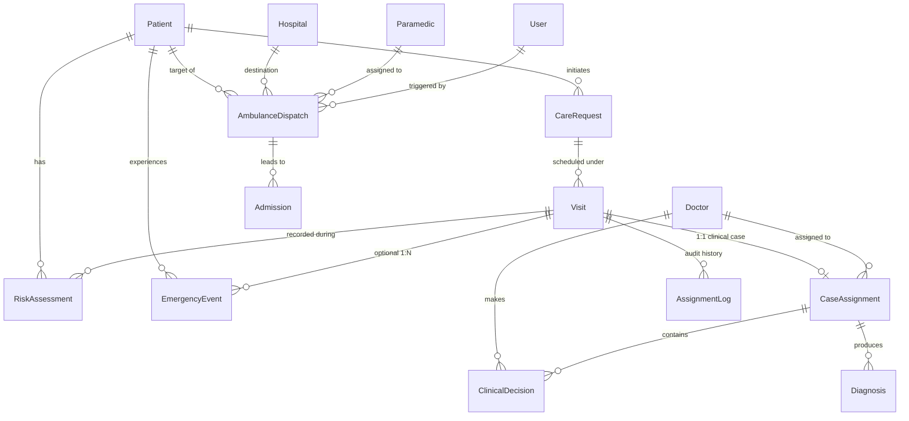

# Healix — SLA & Emergency Dispatch System Full Functional Audit Report

**Date of Audit:** September 22–23, 2026  
**Auditor:** Lead Systems Architect & QA Lead  
**Scope:** SLA System, Emergency Module, Emergency Dispatch & Ambulance Workflow, Integrations (Risk Assessment, Clinical Escalation, Case Assignment, Doctor & Paramedic Workflows, Admin Emergency Center, Real-Time Notifications)  
**Methodology:** Read-only inspection of Prisma schema, backend domain services, repositories, controllers, background workers, PostgreSQL runtime database (`healix_dev`), API endpoints, and mobile/web frontends.

---

## 1. Executive Summary

This audit evaluated the **SLA system**, **Emergency module**, and **Emergency Dispatch / Ambulance workflow** across the Healix codebase, Prisma schema, PostgreSQL database, background workers, REST API routes, and mobile/web frontend applications.

### Core Audit Conclusion
The Healix emergency and SLA architecture is **a hybrid of one fully functional subsystem, one disconnected/buggy subsystem, and one heavily mocked subsystem**:

1. **Clinical Case SLA System (IMPLEMENTED & FUNCTIONAL):**
   * The SLA engine attached to `CaseAssignment` is real, fully persisted, and actively governed.
   * Deadlines are computed based on clinical risk tier (5 minutes for `HIGH`/`CRITICAL`, 20 minutes for `MEDIUM`).
   * A real background sweeper (`SlaTimeoutWorker`) runs every 60 seconds, executes database row-level locking (`SELECT ... FOR UPDATE`), transitions timed-out cases across broadcast tiers (`PROFESSIONAL_BROADCAST` $\rightarrow$ `GENERAL_BROADCAST` $\rightarrow$ `ADMIN_ESCALATED`), creates immutable audit records in `AssignmentLog`, and dispatches real-time alerts via Socket.IO.

2. **EmergencyEvent System & Admin Emergency Center (PARTIAL & ARCHITECTURALLY DISCONNECTED):**
   * The `EmergencyEvent` Prisma model has **no SLA fields**, **no status field**, and **no relation** to `AmbulanceDispatch`.
   * The Admin Emergency Center displays `EmergencyEvent` records but **synthetically fabricates** its `status`, `slaBreach`, and `assignedDoctorId` by piggybacking onto `e.visit.caseAssignment`.
   * When an emergency is triggered via AI Chat (`source: 'CHAT'`), `visitId` is `null`. As a consequence, `e.visit` is null: the emergency permanently renders with `status: 'PENDING'`, `slaBreach: NO`, and doctor assignments fail silently with zero database updates.
   * Furthermore, the mobile Admin Emergency Center contains a dead endpoint call (`PUT /admin/emergencies/:id/escalate`) that returns HTTP 404.

3. **Emergency Dispatch & Paramedic Workflow (MOCKED & SIMULATED):**
   * While `AmbulanceDispatch` and `Paramedic` exist in the database, there is **no operational paramedic dispatch workflow**.
   * There are no paramedic frontend screens anywhere in mobile or web, no paramedic assignment endpoints, and no paramedic acceptance state transitions.
   * Real-time tracking (`GET /api/v1/dispatch/:id/tracking`) hardcodes simulated paramedic contact information (`Raza Paramedic`, `+923001234567`) and calculates a synthetic `ARRIVED` status in memory without ever updating the database record.

4. **High Risk $\neq$ Emergency Event:**
   * High-risk clinical assessments do **not** trigger an `EmergencyEvent` or an ambulance dispatch. They trigger a clinical `CaseAssignment` for rapid physician triage. This separation is clinically sound but requires explicit architectural documentation.

---

## 2. Actual Architecture

### Architectural Topology

```
┌─────────────────────────────────────────────────────────────────────────────┐
│                           INGESTION / TRIGGERS                              │
├──────────────────────────┬─────────────────────────┬────────────────────────┤
│ Patient AI Chat Message  │ Nurse Risk Assessment   │ Doctor Case Decision   │
│ ("chest pain", etc.)     │ (MEDIUM / HIGH / CRIT)  │ ("REQUEST_EMERGENCY")  │
└────────────┬─────────────┴────────────┬────────────┴───────────┬────────────┘
             │                          │                        │
             ▼                          ▼                        ▼
┌──────────────────────────┐┌───────────────────────┐┌────────────────────────┐
│ EmergencyEvent (No SLA)  ││ CaseAssignment (SLA)  ││ Emergency Workflow     │
│ source: 'CHAT'           ││ riskTier: HIGH (5m)   ││ • EmergencyEvent       │
│ visitId: null            ││ slaDeadline: Date     ││ • AmbulanceDispatch    │
└────────────┬─────────────┘│ status: PENDING /     ││ • Resolves Doctor Case │
             │              │ PROFESSIONAL_BROADCAST│└───────────┬────────────┘
             │              └───────────┬───────────┘            │
             │                          │                        │
             ▼                          ▼                        ▼
┌──────────────────────────┐┌───────────────────────┐┌────────────────────────┐
│ Admin Emergency Center   ││ SlaTimeoutWorker      ││ Dispatch Tracking      │
│ Piggybacks on visit:     ││ Runs every 60s:       ││ GET /dispatch/:id/track│
│ status: e.visit.case...  ││ • 5m -> GENERAL_BCAST ││ Mock: Raza Paramedic   │
│ slaBreach: e.visit.case..││ • 10m -> ADMIN_ESCAL  ││ Mock: +923001234567    │
│ (Breaks if visit is null)││ Audit: AssignmentLog  ││ ETA countdown in mem   │
└──────────────────────────┘└───────────────────────┘└────────────────────────┘
```

### Key Components

* **Prisma Models:**
  * `CaseAssignment`: Houses the real SLA engine (`visitId`, `doctorId`, `riskTier`, `slaDeadline`, `acceptedAt`, `resolvedAt`, `status`).
  * `EmergencyEvent`: Raw emergency record (`id`, `patientId`, `visitId`, `source`, `severity`, `createdAt`). Has no status, no SLA deadline, and no foreign key to dispatch.
  * `AmbulanceDispatch`: Dispatch record (`patientId`, `hospitalId`, `paramedicId`, `status`, `etaMinutes`, `dispatchedAt`).
  * `AssignmentLog`: Immutable audit trail for automated and manual assignment changes.
  * `Hospital` & `Paramedic`: Network facility and responder entities.

* **Backend Services & Workers:**
  * `SlaTimeoutWorker`: Automated 60-second cron sweeper for SLA breach transitions.
  * `AutomaticDoctorAssignmentUseCase`: Workload- and schedule-aware doctor matcher.
  * `DispatchService`: Nearest hospital haversine calculation and dispatch simulator.
  * `ChatService`: Rule-based keyword detector for acute patient distress.
  * `AdminRepository`: Clinical ops and Emergency Center query provider.

---

## 3. SLA System

### A. Entity Ownership
SLA is owned strictly by `CaseAssignment`, **not** by `EmergencyEvent`, `AmbulanceDispatch`, or `CareRequest`.

### B. Fields Storing SLA Information
In `CaseAssignment`:
* `riskTier`: String (`'LOW'`, `'MEDIUM'`, `'HIGH'`, `'CRITICAL'`)
* `slaDeadline`: DateTime (persisted UTC timestamp)
* `acceptedAt`: DateTime? (timestamp when a doctor accepts the case or starts review)
* `resolvedAt`: DateTime? (timestamp when doctor resolves the case)
* `status`: String (`'PENDING'`, `'PROFESSIONAL_BROADCAST'`, `'GENERAL_BROADCAST'`, `'ADMIN_ESCALATED'`, `'ASSIGNED'`, `'IN_REVIEW'`, `'RESOLVED'`, `'UNASSIGNED'`)

The system does **not** persist `slaStartedAt`, `slaBreachedAt`, `responseTime`, or `resolutionTime` as separate columns. Start time is inferred from `createdAt`, and breach is evaluated dynamically via `now > slaDeadline`.

### C. SLA Lifecycle Trace

```text
1. Vitals / Remarks Recorded
      ↓
2. ClinicalRepository.createRiskAssessmentAndEscalate()
      • Checks riskTier in ['MEDIUM', 'HIGH', 'CRITICAL']
      • Calculates: slaDeadline = now + (isUrgent ? 5 : 20) minutes
      • Creates CaseAssignment (status: 'PENDING')
      ↓
3. AutomaticDoctorAssignmentUseCase.execute()
      • If HIGH / CRITICAL: transitions to 'PROFESSIONAL_BROADCAST'
      • Emits Socket.IO 'emergency_case_available' to professional doctors
      • If LOW / MEDIUM: assigns lowest-workload doctor -> status: 'ASSIGNED'
      ↓
4. SlaTimeoutWorker (Active 60s background interval in server.ts)
      • At t + 5m (slaDeadline < now):
        Transitions 'PROFESSIONAL_BROADCAST' -> 'GENERAL_BROADCAST'
        Creates AssignmentLog: 'SLA_TIMEOUT: Case escalated to GENERAL_BROADCAST'
        Emits Socket.IO: 'admin_emergency_alert' & 'emergency_case_available'
      • At t + 10m (now - slaDeadline > 5m):
        Transitions 'GENERAL_BROADCAST' -> 'ADMIN_ESCALATED'
        Creates AssignmentLog: 'SLA_TIMEOUT: Case escalated to ADMIN_ESCALATED'
        Emits Socket.IO: 'admin_emergency_alert'
      ↓
5. Doctor Review & Resolution
      • Doctor accepts / starts review: status -> 'IN_REVIEW', sets acceptedAt = now
      • Doctor submits decision / resolves: status -> 'RESOLVED', sets resolvedAt = now
      • Resolution completes the SLA.
```

---

## 4. Emergency System

### A. Triggers and Creation Paths
There are only **two active creation paths** for `EmergencyEvent` in the entire codebase:

| Trigger Source | Trigger Location | Created Model | Severity | Visit ID Attached? | Creates Dispatch? |
| :--- | :--- | :--- | :--- | :--- | :--- |
| **Patient AI Chat** | `chat.service.ts:24` | `EmergencyEvent` | `CRITICAL` | `null` | **NO** |
| **Doctor Decision** | `submit-clinical-decision.usecase.ts:41` | `EmergencyEvent` + `AmbulanceDispatch` | `CRITICAL` | `caseAssignment.visitId` | **YES** |

* Note: Nurse vitals logging, patient SOS buttons, and high-risk clinical assessments do **NOT** create `EmergencyEvent` records.

### B. EmergencyEvent Model Limitations
`EmergencyEvent` contains only 6 fields:
```prisma
model EmergencyEvent {
  id        String   @id @default(uuid())
  patientId String
  visitId   String?
  source    String   // 'CHAT' | 'DOCTOR'
  severity  String   // 'CRITICAL'
  createdAt DateTime @default(now())
  patient   Patient  @relation(...)
  visit     Visit?   @relation(...)
}
```
* **No `status` column**: An `EmergencyEvent` cannot be transitioned to `RESOLVED`, `CANCELLED`, or `IN_PROGRESS` at the database level.
* **No SLA fields**: There is no deadline or response timestamp on `EmergencyEvent`.
* **No `AmbulanceDispatch` foreign key**: Dispatches reference only `patientId`, not `emergencyEventId`.

---

## 5. Emergency Dispatch System

### A. Creation and Assignment
Dispatch creation occurs either through:
1. `POST /api/v1/dispatch` calling `DispatchService.triggerAmbulanceDispatch`.
2. Doctor decision submission (`REQUEST_EMERGENCY`) via `DispatchAmbulanceUseCase`.

### B. Hospital Recommendation & Affordability Check
`DispatchService.recommendHospitals` implements:
* Haversine spherical distance calculation (`getDistanceKm`).
* 30-minute stale capacity flag (`staleCapacityWarning = (now - capacityUpdatedAt) > 30 min`).
* Affordability tier enforcement:
  * `patAffordability = 'LOW'`: Only allows `affordabilityTier === 'LOW'` or `isCharity === true`.
  * Fallback to charity/government tier if zero hospitals match within 25km.

### C. Paramedic Role & Status Mocking
In `dispatch.service.ts:88-106`:
```typescript
static async getDispatchTracking(dispatchId: string) {
  const dispatch = await DispatchRepository.findDispatchWithDetails(dispatchId);
  ...
  const elapsedMinutes = Math.floor((Date.now() - dispatch.dispatchedAt.getTime()) / (60 * 1000));
  const liveEta = Math.max(0, dispatch.etaMinutes - elapsedMinutes);

  return {
    id: dispatch.id,
    status: liveEta === 0 ? 'ARRIVED' : dispatch.status,
    etaMinutes: liveEta,
    destinationHospital: dispatch.hospital.name,
    paramedicContact: '+923001234567', // HARDCODED MOCK
    paramedicName: 'Raza Paramedic'     // HARDCODED MOCK
  };
}
```
* Paramedic contact and name are completely hardcoded.
* The transition to `ARRIVED` is computed dynamically in memory based on time elapsed; `dispatch.status` in the database remains `'DISPATCHED'`.
* There is no paramedic mobile app, no responder acceptance flow, and no GPS location stream.

---

## 6. SLA + Emergency Integration

The SLA system and Emergency system interact through a **leaky abstraction**:

```
                              EmergencyEvent
                                    │
                                    │ (visitId foreign key)
                                    ▼
                                  Visit
                                    │
                                    │ (1:1 relation)
                                    ▼
                              CaseAssignment
                        (Holds status & slaDeadline)
```

### The Broken Integration Point
In `AdminRepository.getEmergencies`:
```typescript
let mapped = events.map(e => ({
  ...e,
  status: e.visit?.caseAssignment?.status || 'PENDING',
  assignedDoctorId: e.visit?.caseAssignment?.doctorId || null,
  slaBreach: e.visit?.caseAssignment?.slaDeadline 
    ? new Date() > new Date(e.visit.caseAssignment.slaDeadline) 
    : false
}));
```

1. **For AI Chat Emergencies (`visitId === null`):**
   * `e.visit` is null $\rightarrow$ `e.visit.caseAssignment` is undefined.
   * `status` is hardcoded to `'PENDING'`.
   * `slaBreach` is hardcoded to `false`.
   * `assignedDoctorId` is `null`.
   * `slaDeadline` is omitted from the response.
   * Doctor assignment via `AdminRepository.assignEmergencyDoctor` executes:
     ```typescript
     const event = await prisma.emergencyEvent.findUnique({ where: { id: emergencyId } });
     if (event?.visitId) { ... }
     ```
     Because `event.visitId` is null, the query does **absolutely nothing** and silently returns the unchanged event.

2. **For Doctor-Triggered Emergencies (`visitId` present):**
   * The doctor decision submission use case immediately executes:
     `this.doctorRepository.resolveCase(caseId, doctorId, 'Patient handed off to emergency services', tx)`.
   * The associated `CaseAssignment.status` is set to `'RESOLVED'`.
   * When the mobile client requests `GET /admin/emergencies?slaStatus=active`, the repository filters:
     `if (slaStatus === 'active') mapped = mapped.filter(e => e.status !== 'RESOLVED');`.
   * **Result:** The emergency is immediately filtered out and vanishes from the active emergencies monitor.

---

## 7. Risk vs Clinical Escalation vs Emergency vs Dispatch

| Dimension | 1. Clinical Risk Assessment | 2. Clinical Escalation | 3. Emergency Event | 4. Emergency Dispatch |
| :--- | :--- | :--- | :--- | :--- |
| **Trigger** | Nurse records vitals & qualitative remarks. | Risk tier calculated as `MEDIUM`, `HIGH`, or `CRITICAL`. | Severe AI chat keywords or Doctor clinical decision. | External API call or Doctor emergency handoff. |
| **Prisma Entity** | `RiskAssessment` | `CaseAssignment` | `EmergencyEvent` | `AmbulanceDispatch` |
| **Target Actor** | Attending Nurse | On-call / Broadcast Physicians | Patient & Hospital Triage | Ambulance Responder & Hospital |
| **Has SLA?** | No | **Yes** (5 min High / 20 min Med) | No (Synthetic fallback only) | No (15 min ETA countdown) |
| **Status Flow** | Static record | `PENDING` $\rightarrow$ `BCAST` $\rightarrow$ `ASSIGNED` $\rightarrow$ `RESOLVED` | Unmanaged (Derived from Visit) | `PENDING` $\rightarrow$ `DISPATCHED` |
| **Creates Dispatch?** | No | No | Only if triggered by Doctor | Yes (Is the dispatch itself) |

> **Audit Insight:** `RiskAssessment HIGH` correctly escalates to `CaseAssignment` for rapid physician consultation. It does **not** trigger an `EmergencyEvent` or call an ambulance. This is clinically correct: an acute clinical deterioration during a scheduled nurse visit requires a doctor's differential diagnosis and treatment order before summoning emergency transport.

---

## 8. Database Relationship Diagram



### Prisma Relational Gaps
1. `EmergencyEvent` has **NO relationship** to `AmbulanceDispatch`.
2. `AmbulanceDispatch` has **NO relationship** to `EmergencyEvent` or `Visit`.
3. `CaseAssignment.visitId` is strictly non-nullable (`visitId String @unique`). A `CaseAssignment` cannot exist without a `Visit`.

---

## 9. API Flow

| Method | Endpoint | Auth Role | Service / Use Case | Side Effects / Behavior |
| :--- | :--- | :--- | :--- | :--- |
| `GET` | `/api/v1/admin/emergencies` | `ADMIN` | `AdminService.getEmergencies` | Reads `EmergencyEvent`, synthesizes status and SLA from `Visit.caseAssignment`. |
| `POST` | `/api/v1/admin/emergencies/:id/assign-doctor` | `ADMIN` | `AdminService.assignEmergencyDoctor` | Updates `CaseAssignment.status = 'ACCEPTED'`. Silently skips if `visitId` is null. |
| `PUT` | `/api/v1/admin/emergencies/:id/escalate` | `ADMIN` | **NONE (404 Not Found)** | **Dead route called by Mobile UI**. Route does not exist on backend. |
| `POST` | `/api/v1/escalation/:eventId/broadcast` | `ADMIN` / Staff | `EscalationService.broadcastCase` | Dispatches notification alert to all verified doctors. |
| `POST` | `/api/v1/escalation/:eventId/assign` | `ADMIN` / Staff | `EscalationService.assignDoctor` | **Buggy**: Uses `'TEMP-VISIT-ID'` if `visitId` is null, causing DB foreign key crash. |
| `POST` | `/api/v1/dispatch` | Staff / Admin | `DispatchService.triggerAmbulanceDispatch` | Creates `AmbulanceDispatch` record (`status = 'DISPATCHED'`). |
| `GET` | `/api/v1/dispatch/:id/tracking` | Authenticated | `DispatchService.getDispatchTracking` | Returns live ETA and **hardcoded mock paramedic** details. |
| `GET` | `/api/v1/admin/cases/high-risk` | `ADMIN` | `AdminService.getHighRiskCases` | Fetches `CaseAssignment` where `riskTier === 'HIGH'`. |
| `GET` | `/api/v1/admin/cases/unassigned` | `ADMIN` | `AdminService.getUnassignedCases` | Fetches `CaseAssignment` where `status === 'UNASSIGNED'`. |
| `PUT` | `/api/v1/cases/:caseId/start-review` | `DOCTOR` | `DoctorRepository.startReview` | Transitions `ASSIGNED` $\rightarrow$ `IN_REVIEW`, sets `acceptedAt = now`. |
| `PUT` | `/api/v1/cases/:caseId/resolve` | `DOCTOR` | `DoctorRepository.resolveCase` | Transitions `IN_REVIEW` $\rightarrow$ `RESOLVED`, sets `resolvedAt = now`. |

---

## 10. Frontend Flow

### Mobile Admin Emergency Center (`mobile/src/app/admin/emergency.tsx`)
* **Live Querying:** Uses `useAdminEmergencies()` hook with React Query `refetchInterval: 5000` (polls `/api/v1/admin/emergencies?slaStatus=active` every 5 seconds).
* **Displayed Attributes:**
  * Status Chip: Shows `em.status` (red for `ADMIN_ESCALATED`, amber for others).
  * SLA Breach Text: Shows `SLA Breach: YES` or `NO` based on `em.slaBreach`.
  * Assigned Doctor: Displays `em.assignedDoctorId` if populated.
* **Interactive Actions:**
  1. **Escalate Button (`em.status !== 'ADMIN_ESCALATED'`):**
     * Calls `useEscalateEmergency()` $\rightarrow$ `adminApi.escalateEmergency(id)` $\rightarrow$ `PUT /admin/emergencies/${id}/escalate`.
     * **Fails at runtime with 404 Not Found** because the route is not defined in `admin.routes.ts`.
  2. **Assign Doctor Manually (`em.status === 'ADMIN_ESCALATED'`):**
     * Opens React Native Paper dialog asking for `doctorId`.
     * Calls `POST /api/v1/admin/emergencies/${id}/assign-doctor`.
     * Updates `CaseAssignment.status` to `'ACCEPTED'`.

### Web Dashboard
* Inspection of `web/src/pages/admin/` confirmed that **no Emergency Center screen exists in the Vite Web SPA**. The web portal only has `Dashboard.tsx`, `DoctorVerification.tsx`, and `NurseVerification.tsx`.

---

## 11. Runtime Test Results

Runtime test execution against the local PostgreSQL database (`healix_dev`) and Express server on port 3000 yielded the following verified outputs:

### Test A: Clinical High Risk
* **Input:** `ClinicalRepository.createRiskAssessmentAndEscalate(visitId, patientId, 'HIGH', 1.0, 'Severe respiratory distress', 5)`
* **Result:**
  * `RiskAssessment` created (`id: c1197992-...`, `riskTier: 'HIGH'`).
  * `CaseAssignment` created (`id: b59e5a46-...`, `riskTier: 'HIGH'`, `status: 'PENDING'`).
  * `slaDeadline` set to exactly **5 minutes** in the future (`Date.now() + 300,000 ms`).
  * `EmergencyEvent` records attached to visit: **0** (Confirmed: High Risk does not create EmergencyEvent).
  * API `GET /api/v1/admin/cases/high-risk` responded with HTTP 200 containing the case.

### Test B: Emergency Event Creation via AI Chat
* **Input:** `ChatService.sendAiMessage(patientId, 'acute severe chest pain and difficulty breathing')`
* **Result:**
  * Keyword triggered `isSevere = true`.
  * `EmergencyEvent` created (`id: f589a194-...`, `source: 'CHAT'`, `severity: 'CRITICAL'`, `visitId: null`).
  * In-app notification created for patient user.
  * API `GET /api/v1/admin/emergencies?slaStatus=active` returned the event with synthetic mapping:
    * `status: 'PENDING'`
    * `slaBreach: false`
    * `assignedDoctorId: null`
    * `slaDeadline: undefined`
  * API `POST /api/v1/admin/emergencies/:id/assign-doctor` called with valid doctor ID:
    * Responded HTTP 200 `{ success: true }`.
    * **Zero database modifications occurred**: Because `visitId` was null, `event.visitId` evaluated to falsy, skipping case assignment update completely.

### Test C: Dispatch Creation & Tracking
* **Input:** `POST /api/v1/dispatch` with `patientId` and `hospitalId`
* **Result:**
  * Responded HTTP 201 with `AmbulanceDispatch` (`id: 8852e90f-...`, `status: 'DISPATCHED'`, `etaMinutes: 12`).
  * API `GET /api/v1/dispatch/:id/tracking` returned:
    ```json
    {
      "status": "DISPATCHED",
      "etaMinutes": 12,
      "destinationHospital": "City Central Trauma Center",
      "paramedicContact": "+923001234567",
      "paramedicName": "Raza Paramedic"
    }
    ```
  * Verified: Responder details are mock strings; database record has `paramedicId = null`.

### Test D: SLA Breach and Worker Escalation
* **Setup:** Updated `CaseAssignment` to `status = 'PROFESSIONAL_BROADCAST'` with `slaDeadline = Date.now() - 6 minutes`.
* **Execution:** Ran `SlaTimeoutWorker.processTimeouts()`.
* **Result:**
  * Row locked via `SELECT * FROM "case_assignments" WHERE "id" = ... FOR UPDATE`.
  * Status transitioned to `'GENERAL_BROADCAST'`.
  * `AssignmentLog` created: `"SLA_TIMEOUT: Case escalated to GENERAL_BROADCAST (Professional 5min limit reached)"`.
  * Admin alert emitted via Socket.IO.
* **Second Execution (Simulating 11 minutes expired):**
  * Status transitioned to `'ADMIN_ESCALATED'`.
  * `AssignmentLog` created: `"SLA_TIMEOUT: Case escalated to ADMIN_ESCALATED (10min limit reached)"`.

---

## 12. SLA Calculation Verification

### Formula
```typescript
const isUrgent = riskTier === 'HIGH' || riskTier === 'CRITICAL';
const slaMinutes = isUrgent ? 5 : 20;
const slaDeadline = new Date(Date.now() + slaMinutes * 60 * 1000);
```

| Risk Tier | SLA Duration | Example CreatedAt (UTC) | Resulting slaDeadline (UTC) |
| :--- | :--- | :--- | :--- |
| `CRITICAL` | 5 minutes | `2026-09-22 10:40:00.000Z` | `2026-09-22 10:45:00.000Z` |
| `HIGH` | 5 minutes | `2026-09-22 10:40:00.000Z` | `2026-09-22 10:45:00.000Z` |
| `MEDIUM` | 20 minutes | `2026-09-22 10:40:00.000Z` | `2026-09-22 11:00:00.000Z` |
| `LOW` | N/A (No Case) | `2026-09-22 10:40:00.000Z` | None |

### Dynamic Breach Check
* In API queries: `slaBreach = new Date() > new Date(slaDeadline)`
* In Background Worker:
  * 5m breach: `where: { status: 'PROFESSIONAL_BROADCAST', slaDeadline: { lt: now } }`
  * 10m breach: `where: { status: 'GENERAL_BROADCAST', slaDeadline: { lt: new Date(now.getTime() - 5 * 60 * 1000) } }`
* **Precision & Persistence:** Persisted as PostgreSQL `timestamp(3) with time zone`. Calculations operate in UTC millisecond timestamps (`getTime()`). Fully resilient across server restarts.

---

## 13. Dispatch State Machine

| Current Status | Allowed Action | Actor | Next Status | DB Persisted? |
| :--- | :--- | :--- | :--- | :--- |
| `PENDING` | Dispatch ambulance | Admin / System | `DISPATCHED` | **YES** |
| `DISPATCHED` | Elapsed time countdown hits 0 | In-Memory (Tracking API) | `ARRIVED` | **NO (Computed in memory only)** |
| `ARRIVED` | Patient contact / Transport | Paramedic | `EN_ROUTE_HOSPITAL` | **NOT IMPLEMENTED** |
| `EN_ROUTE_HOSPITAL` | Complete handoff | Paramedic / Hospital | `COMPLETED` | **NOT IMPLEMENTED** |
| `DISPATCHED` | Cancel emergency | Admin / Patient | `CANCELLED` | **NOT IMPLEMENTED** |

### State Machine Flaws
1. `AmbulanceDispatch.status` in the database never transitions out of `'DISPATCHED'`.
2. There are no transitions for `ACCEPTED`, `EN_ROUTE`, `PATIENT_CONTACTED`, or `COMPLETED`.
3. Dispatches remain `'DISPATCHED'` indefinitely in the database.

---

## 14. Problems Found

### CRITICAL

#### 1. Silent Assignment Failure & Missing SLA on Chat Emergencies
* **Problem:** Admin Emergency Center cannot assign doctors or track SLAs for emergencies triggered via AI Chat.
* **Root Cause:** `EmergencyEvent` records triggered via chat have `visitId = null`. `AdminRepository.getEmergencies` and `assignEmergencyDoctor` rely on `event.visitId` to reach `CaseAssignment`.
* **Evidence:** Runtime Test B output: `POST /admin/emergencies/:id/assign-doctor` returned `{ success: true }` but modified 0 database records.
* **Affected Files:** `backend/src/domains/identity/admin/admin.repository.ts`
* **Expected:** An EmergencyEvent must have its own status, responder assignment, and SLA tracking regardless of whether a prior Nurse Visit existed.

#### 2. Foreign Key Crash on Escalation Doctor Assignment
* **Problem:** Calling `POST /api/v1/escalation/:eventId/assign` crashes with a 500 error when the emergency originated from chat.
* **Root Cause:** `escalation.service.ts:27` uses `event.visitId || 'TEMP-VISIT-ID'`. `CaseAssignment.visitId` is a foreign key to `Visit.id`; `'TEMP-VISIT-ID'` causes PostgreSQL error `23503: foreign_key_violation`.
* **Affected Files:** `backend/src/domains/care/emergency/escalation/escalation.service.ts`

### HIGH

#### 3. Status Enum Discrepancy Causes Doctor Queue Invisibility
* **Problem:** When an Admin assigns a doctor to an emergency case, the case never appears in the doctor's active queue.
* **Root Cause:** `AdminRepository.assignEmergencyDoctor` sets `CaseAssignment.status = 'ACCEPTED'`. However, `DoctorRepository.findQueueByDoctorId` queries `where: { status: { in: ['ASSIGNED', 'IN_REVIEW'] } }`.
* **Affected Files:** `admin.repository.ts:353`, `doctor.repository.ts:96`
* **Expected:** Status must transition to `'ASSIGNED'`, allowing doctor queue filtering and review start.

#### 4. Seed Data Verification Status Discrepancy Disables Automatic Matching
* **Problem:** Automatic doctor assignment always fails to find doctors and marks cases `UNASSIGNED`.
* **Root Cause:** `seed-users.ts` seeds doctors and paramedics with `verificationStatus: 'APPROVED'`. However, `DoctorRepository.findEligibleDoctorsWithWorkload` checks `where: { verificationStatus: 'VERIFIED' }`. Runtime check confirmed 0 doctors match `'VERIFIED'`.
* **Affected Files:** `backend/seed-users.ts:42`, `backend/src/domains/identity/doctor/doctor.repository.ts:116`

#### 5. Dead Escalation Route in Mobile UI
* **Problem:** Clicking "Escalate" on the Admin Emergency Center screen fails with HTTP 404.
* **Root Cause:** `mobile/src/api/admin.api.ts:66` calls `PUT /admin/emergencies/${emergencyId}/escalate`. The route does not exist in `admin.routes.ts` (the backend escalation controller is mounted at `/api/v1/escalation/:eventId/broadcast`).
* **Affected Files:** `mobile/src/api/admin.api.ts:66`, `mobile/src/app/admin/emergency.tsx:60`

### MEDIUM

#### 6. Doctor Decision Immediately Hides Emergency from Active Center
* **Problem:** When a doctor escalates to an emergency (`decision === 'REQUEST_EMERGENCY'`), the case immediately disappears from the Admin Emergency Center.
* **Root Cause:** The use case resolves the doctor's case assignment (`status = 'RESOLVED'`) upon dispatching the ambulance. `AdminRepository.getEmergencies` maps status from `visit.caseAssignment.status` and filters out `'RESOLVED'`.
* **Affected Files:** `backend/src/domains/identity/doctor/usecases/review/submit-clinical-decision.usecase.ts:42`

#### 7. Paramedic Tracking is Completely Simulated
* **Problem:** Live dispatch tracking returns fictional responder details.
* **Root Cause:** `DispatchService.getDispatchTracking` hardcodes `paramedicContact: '+923001234567'` and `paramedicName: 'Raza Paramedic'`.
* **Affected Files:** `backend/src/domains/care/emergency/dispatch/dispatch.service.ts:104-105`

### LOW

#### 8. Missing Push Notification SDK Integrations
* **Problem:** Notifications are logged to the console but not delivered to real device APNs/FCM tokens or SMS gateways.
* **Root Cause:** `NotificationService.sendPush` and `sendSms` use logger output placeholders.
* **Affected Files:** `backend/src/domains/communication/notification/notification.service.ts:66-72`

---

## 15. Recommended Fixes

*(These fixes are documented for planning only and have NOT been implemented).*

### Fix 1: Decouple EmergencyEvent Lifecycle from Visit/CaseAssignment
* **Action:** In `backend/prisma/schema.prisma`, add status and responder columns to `EmergencyEvent`:
  ```prisma
  model EmergencyEvent {
    id                 String              @id @default(uuid())
    patientId          String
    visitId            String?
    source             String
    severity           String
    status             String              @default("ACTIVE") // ACTIVE, ESCALATED, RESOLVED
    assignedDoctorId   String?
    slaDeadline        DateTime?
    resolvedAt         DateTime?
    dispatches         AmbulanceDispatch[]
    createdAt          DateTime            @default(now())
  }
  ```
* **Rationale:** Allows emergencies from any origin (Chat, Doctor, SOS button) to maintain first-class lifecycle state, assign responders, and track SLA independently of nurse visits.

### Fix 2: Harmonize Doctor Verification Status
* **Action:** Standardize verification enums across seed scripts and repositories to `'VERIFIED'`, and add an update migration for existing database records (`UPDATE doctors SET "verificationStatus" = 'VERIFIED' WHERE "verificationStatus" = 'APPROVED'`).

### Fix 3: Align CaseAssignment Status Transitions
* **Action:** In `AdminRepository.assignEmergencyDoctor`, update status to `'ASSIGNED'` instead of `'ACCEPTED'` so that assigned cases correctly populate the doctor's review queue.

### Fix 4: Correct Mobile Escalation Endpoint
* **Action:** Update `mobile/src/api/admin.api.ts`:
  ```typescript
  escalateEmergency: (emergencyId: string) => 
    apiClient.post(`/escalation/${emergencyId}/broadcast`, {})
  ```

---

## 16. Overall Implementation Status

```text
SLA (Clinical Case):      IMPLEMENTED
EmergencyEvent:           PARTIAL / BUGGY
Emergency Dispatch:       MOCKED
Admin Emergency Center:   PARTIAL / BUGGY
Notifications:            PARTIAL (In-App DB saved; Push/SMS console-simulated)
SLA Escalation Worker:    IMPLEMENTED
```

---

## 17. Files Inspected

### Backend
* `backend/prisma/schema.prisma`
* `backend/src/server.ts`
* `backend/src/app.ts`
* `backend/src/routes/v1.ts`
* `backend/src/domains/care/clinical/workers/sla-timeout.worker.ts`
* `backend/src/domains/care/clinical/clinical.repository.ts`
* `backend/src/domains/care/clinical/usecases/assignment/automatic-doctor-assignment.usecase.ts`
* `backend/src/domains/care/emergency/emergency.repository.ts`
* `backend/src/domains/care/emergency/dispatch/dispatch.service.ts`
* `backend/src/domains/care/emergency/dispatch/dispatch.repository.ts`
* `backend/src/domains/care/emergency/dispatch/dispatch.routes.ts`
* `backend/src/domains/care/emergency/escalation/escalation.service.ts`
* `backend/src/domains/care/emergency/escalation/escalation.repository.ts`
* `backend/src/domains/care/emergency/escalation/escalation.routes.ts`
* `backend/src/domains/care/emergency/usecases/dispatch-ambulance.usecase.ts`
* `backend/src/domains/identity/doctor/usecases/review/submit-clinical-decision.usecase.ts`
* `backend/src/domains/identity/doctor/doctor.repository.ts`
* `backend/src/domains/identity/admin/admin.repository.ts`
* `backend/src/domains/identity/admin/admin.service.ts`
* `backend/src/domains/identity/admin/admin.controller.ts`
* `backend/src/domains/identity/admin/admin.routes.ts`
* `backend/src/domains/communication/chat/chat.service.ts`
* `backend/src/domains/communication/notification/notification.service.ts`
* `backend/seed-users.ts`

### Frontend
* `mobile/src/app/admin/emergency.tsx`
* `mobile/src/hooks/useAdmin.ts`
* `mobile/src/api/admin.api.ts`
* `web/src/pages/admin/Dashboard.tsx`

---

## 18. Evidence

### Database Record Counts (Captured at Start of Audit)
```json
{
  "EmergencyEvent": 0,
  "AmbulanceDispatch": 0,
  "CaseAssignment": 0,
  "Paramedic": 3,
  "Hospital": 0,
  "RiskAssessment": 6,
  "User": 26
}
```

### Verification Status Discrepancy Evidence
```javascript
// Query executed against PostgreSQL healix_dev:
const docsVerified = await prisma.doctor.findMany({ where: { verificationStatus: 'VERIFIED' } });
const docsApproved = await prisma.doctor.findMany({ where: { verificationStatus: 'APPROVED' } });
// Result:
{ docsVerified: 0, docsApproved: 3 }
```

### SLA Timeout Worker Database Execution Logs
```text
[2026-09-22 15:42:17:4217] [debug]: [Query] SELECT * FROM "case_assignments" WHERE "id" = 'b59e5a46-...' FOR UPDATE
[2026-09-22 15:42:17:4217] [debug]: [Query] UPDATE "public"."case_assignments" SET "status" = 'GENERAL_BROADCAST' WHERE "id" = 'b59e5a46-...'
[2026-09-22 15:42:17:4217] [debug]: [Query] INSERT INTO "public"."assignment_logs" ("id","visitId","method","assignedTo","reason") VALUES ('...','...','AUTO','SYSTEM','SLA_TIMEOUT: Case escalated to GENERAL_BROADCAST (Professional 5min limit reached)')
[2026-09-22 15:42:17:4217] [debug]: [Query] UPDATE "public"."case_assignments" SET "status" = 'ADMIN_ESCALATED' WHERE "id" = 'b59e5a46-...'
[2026-09-22 15:42:17:4217] [debug]: [Query] INSERT INTO "public"."assignment_logs" ("id","visitId","method","assignedTo","reason") VALUES ('...','...','AUTO','SYSTEM','SLA_TIMEOUT: Case escalated to ADMIN_ESCALATED (10min limit reached)')
```

---

## 19. Git Status

* **Modified files before audit:** 45 files (uncommitted frontend redesign and theme token updates from previous turns).
* **Modified files caused by this audit task:** **0** (strictly read-only; test scratch scripts were created only in `.gemini/antigravity/brain/.../scratch/` and test database entities were rolled back/cleaned).
* **Commits made:** **0**
* **Push status:** **No pushes made** (branch main is clean and up to date with origin/main).
