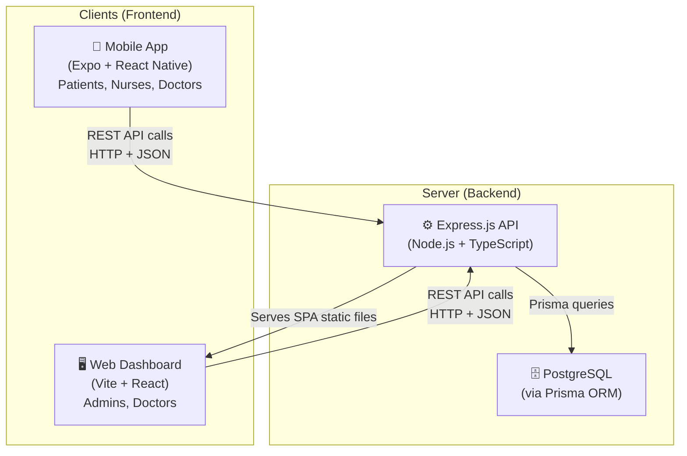
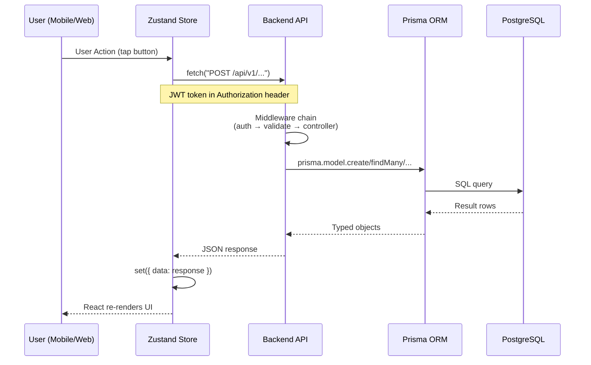
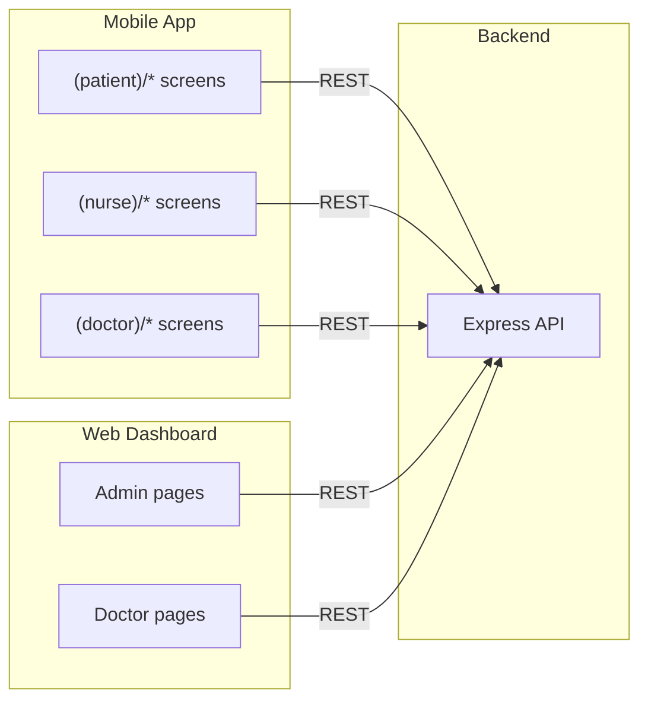
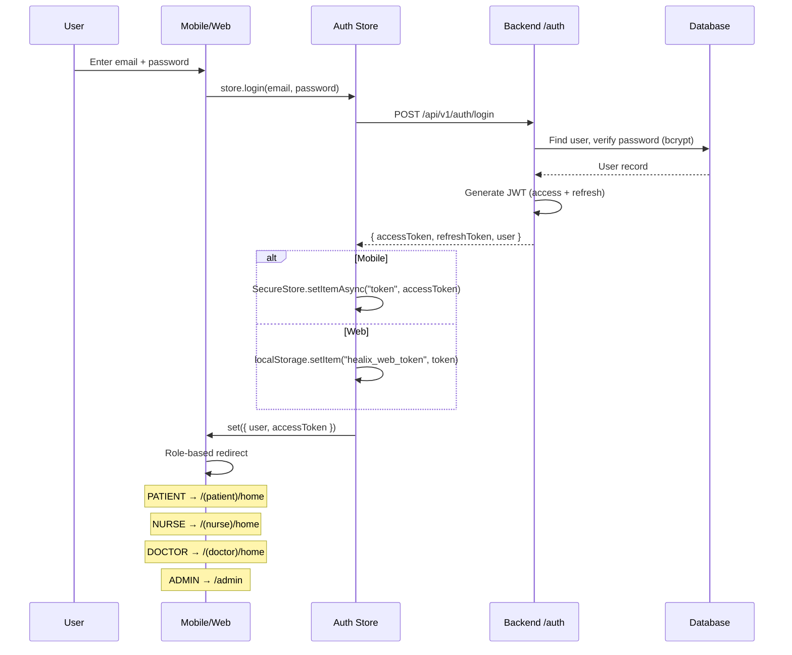
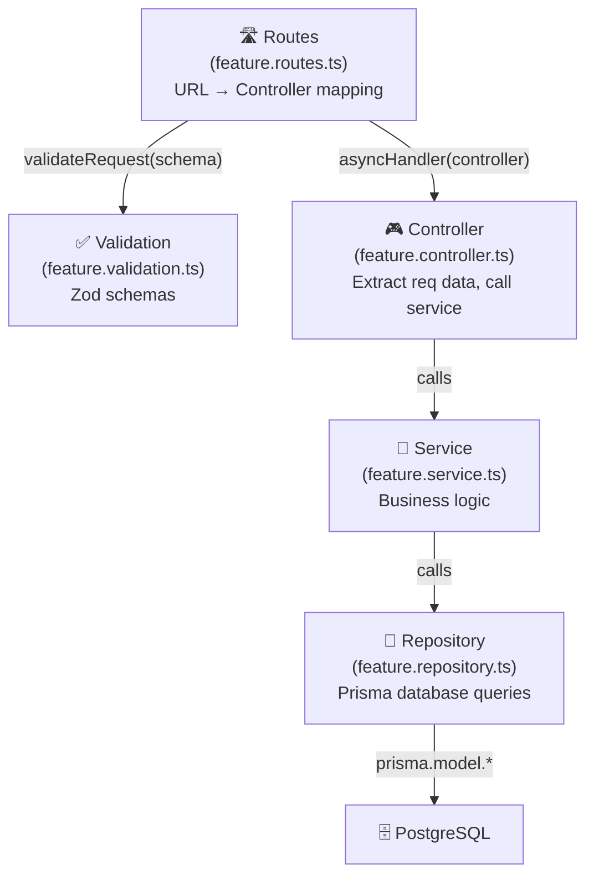
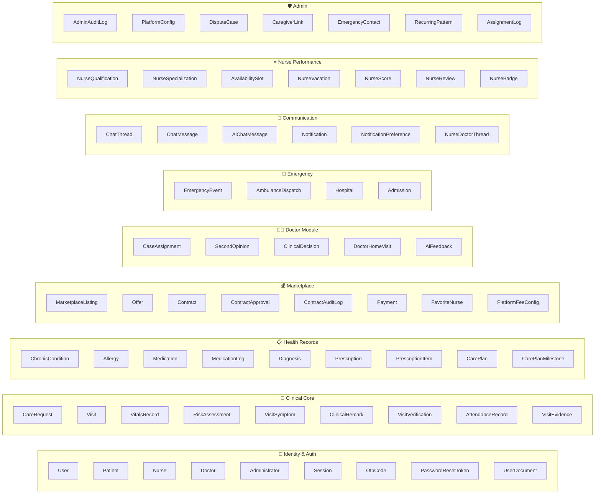

# 🏥 Healix — Lesson 1: Overall Architecture & Project Structure

> **Objective**: After this lesson you will understand what Healix is, how its three applications connect, what technology each part uses, how data flows through the entire system, and what every top-level folder is responsible for.

---

## 1.1 — What Is Healix?

Healix is a **home healthcare management platform** built for the Pakistani market. It connects four types of users:

| Role | Who They Are | What They Do |
|---|---|---|
| **Patient** | A person receiving home care | Requests nurse visits, views health records, chats with AI, tracks prescriptions |
| **Nurse** | PNC-licensed home nurse | Accepts patient visits, records vitals, submits clinical observations |
| **Doctor** | PMDC-verified physician | Reviews escalated cases, diagnoses, prescribes medication, orders home visits |
| **Admin** | Platform operator | Verifies credentials, manages users, monitors marketplace, configures platform |

> [!IMPORTANT]
> Every feature in the entire codebase is ultimately serving one of these four roles. If you ever feel lost in a file, ask yourself: *"Which of the four roles does this serve?"* — that will immediately anchor you.

---

## 1.2 — The Three Applications

Healix is a **monorepo** containing three completely separate applications sharing one backend:



| Application | Location | Technology | Who Uses It |
|---|---|---|---|
| **Mobile** | `mobile/` | Expo SDK 57, React Native, Expo Router, Zustand | Patients, Nurses, Doctors |
| **Web** | `web/` | Vite, React, React Router DOM, Zustand | Admins, Doctors |
| **Backend** | `backend/` | Express.js, Prisma, PostgreSQL, JWT, Zod, Winston | All clients talk to this |

### Key Insight: The Web App Is Served BY the Backend

Look at [app.ts](file:///f:/class%20Data/FYP%20Project/Proposal/Project/Healix/backend/src/app.ts#L33-L43):

```typescript
// Serve Web SPA static assets
const webDistPath = path.resolve(__dirname, '../../web/dist');
app.use(express.static(webDistPath));

// Fallback all non-API requests to index.html for SPA routing
app.get('*', (req, res, next) => {
  if (req.path.startsWith('/api') || req.path.startsWith('/health')) {
    return next();
  }
  res.sendFile(path.join(webDistPath, 'index.html'));
});
```

In production, the Express server serves the web dashboard's built files. The mobile app communicates with the same server via HTTP REST calls.

---

## 1.3 — Technology Stack (Complete)

### Backend
| Technology | Purpose | File(s) |
|---|---|---|
| **Express.js** | HTTP server framework | [app.ts](file:///f:/class%20Data/FYP%20Project/Proposal/Project/Healix/backend/src/app.ts) |
| **Prisma** | ORM (database access layer) | [schema.prisma](file:///f:/class%20Data/FYP%20Project/Proposal/Project/Healix/backend/prisma/schema.prisma) |
| **PostgreSQL** | Relational database | Configured in `.env` via `DATABASE_URL` |
| **Zod** | Request payload validation | `*.validation.ts` files in every feature |
| **JWT (jsonwebtoken)** | Authentication tokens | [authMiddleware.ts](file:///f:/class%20Data/FYP%20Project/Proposal/Project/Healix/backend/src/common/middleware/authMiddleware.ts) |
| **bcrypt** | Password hashing | Used in auth service |
| **Winston** | Structured logging | [logger utility](file:///f:/class%20Data/FYP%20Project/Proposal/Project/Healix/backend/src/common/utils) |
| **Helmet** | HTTP security headers | [app.ts](file:///f:/class%20Data/FYP%20Project/Proposal/Project/Healix/backend/src/app.ts) |
| **Multer** | File upload handling | Document uploads |
| **Socket.IO** | Real-time events (installed) | Listed in dependencies |

### Mobile
| Technology | Purpose | File(s) |
|---|---|---|
| **Expo SDK 57** | React Native framework | [app.json](file:///f:/class%20Data/FYP%20Project/Proposal/Project/Healix/mobile/app.json) |
| **Expo Router** | File-based navigation | `src/app/` directory |
| **React Native Paper** | Material Design UI kit | Used across all screens |
| **Zustand** | State management | `src/store/*.ts` |
| **Expo Secure Store** | Encrypted token storage | Used by auth store |
| **React Native Reanimated** | Animations | Used for UI transitions |

### Web
| Technology | Purpose | File(s) |
|---|---|---|
| **Vite** | Build tool + dev server | [vite.config.ts](file:///f:/class%20Data/FYP%20Project/Proposal/Project/Healix/web/vite.config.ts) |
| **React + TypeScript** | UI framework | [App.tsx](file:///f:/class%20Data/FYP%20Project/Proposal/Project/Healix/web/src/App.tsx) |
| **React Router DOM** | Client-side routing | Routes in App.tsx |
| **Zustand** | State management | `web/src/store/*.ts` |

---

## 1.4 — How Communication Works



### The Communication Contract

1. **All API URLs** are prefixed with `/api/v1/` — this is defined in [routes/index.ts](file:///f:/class%20Data/FYP%20Project/Proposal/Project/Healix/backend/src/routes/index.ts)
2. **Authentication** uses **JWT Bearer tokens** in the `Authorization` header
3. **All request bodies** are validated with **Zod schemas** before reaching business logic
4. **All responses** follow a standardized format via `sendSuccessResponse()` / `sendErrorResponse()`
5. **Mobile stores** use `fetch()` directly — there is no Axios
6. **Web stores** use a helper `api()` function that auto-attaches the JWT token

---

## 1.5 — The Four Roles & Their Application Mapping



| Role | Mobile Access | Web Access |
|---|---|---|
| **Patient** | ✅ Full app (home, requests, health, AI, messages, profile) | ❌ No web access |
| **Nurse** | ✅ Full app (home, visits, bids, messages, profile) | ❌ No web access |
| **Doctor** | ✅ Mobile app (cases, reviews, diagnosis) | ✅ Web dashboard (queue, case review, home visits) |
| **Admin** | ✅ Limited mobile (stats, user mgmt) | ✅ Full web dashboard (everything) |

---

## 1.6 — Authentication Flow (High Level)



> [!NOTE]
> The mobile app uses `expo-secure-store` (encrypted) for token storage. The web app uses `localStorage` (unencrypted). Both attach the token to every subsequent API request.

---

## 1.7 — Monorepo Folder Structure

```
Healix/                          ← Monorepo root
├── package.json                 ← Root package (scripts to run backend/mobile)
├── pnpm-workspace.yaml          ← Declares backend/ and mobile/ as workspace packages
│
├── backend/                     ← 🔵 Express.js API Server
│   ├── .env                     ← Environment variables (PORT, DB, JWT secrets)
│   ├── package.json             ← Backend dependencies
│   ├── tsconfig.json            ← TypeScript config
│   ├── prisma/
│   │   └── schema.prisma        ← 🔑 DATABASE SCHEMA (40+ models, single source of truth)
│   └── src/
│       ├── server.ts            ← 🚀 Entry point (starts HTTP server)
│       ├── app.ts               ← Express app config (middleware + route mounting)
│       ├── seed.ts              ← Dev script to populate test data
│       ├── routes/
│       │   ├── index.ts         ← Maps /api → /v1
│       │   └── v1.ts            ← Aggregates ALL 16 feature routers
│       ├── common/              ← Shared infrastructure (cross-cutting concerns)
│       │   ├── config/          ← Database, env validation, admin seeding
│       │   ├── constants/       ← HTTP status codes, auth constants, pagination
│       │   ├── errors/          ← Custom AppError class, Prisma error mapper
│       │   ├── middleware/      ← Auth, RBAC, validation, error handler, logging
│       │   └── utils/           ← Logger, pagination, response helpers
│       └── features/            ← 🏗️ Domain modules (each is self-contained)
│           ├── admin/           ← User management, verifications, audit logs
│           ├── auth/            ← Registration, login, OTP, JWT, password reset
│           ├── care/            ← Care request scheduling, assignment, compliance
│           ├── chat/            ← Real-time messaging threads
│           ├── clinical/        ← AI risk assessment, knowledge queries
│           ├── contract/        ← Patient-nurse service contracts
│           ├── doctor/          ← Doctor queue, diagnosis, prescriptions, home visits
│           ├── emergency/       ← Escalation → Dispatch → Admission pipeline
│           ├── health/          ← Health check endpoint
│           ├── marketplace/     ← Nurse bidding system for care requests
│           ├── notification/    ← Push/SMS/in-app notifications
│           ├── nurse/           ← Nurse profiles, visits, scores, availability
│           ├── patient/         ← Patient profiles, medical history, vitals
│           └── visit/           ← Visit lifecycle + verification methods
│
├── mobile/                      ← 📱 Expo React Native App
│   ├── app.json                 ← Expo configuration
│   ├── package.json             ← Mobile dependencies
│   └── src/
│       ├── app/                 ← 📂 File-based routing (Expo Router)
│       │   ├── _layout.tsx      ← 🔑 ROOT LAYOUT (auth guard + role routing)
│       │   ├── index.tsx        ← Initial redirect based on role
│       │   ├── auth/            ← Login, Register, OTP, Password screens
│       │   ├── (patient)/       ← Patient tab navigator + screens
│       │   ├── (nurse)/         ← Nurse tab navigator + screens
│       │   ├── (doctor)/        ← Doctor tab navigator + screens
│       │   ├── (admin)/         ← Admin mobile screens
│       │   └── admin/           ← Additional admin screens
│       ├── components/          ← Reusable UI components
│       │   ├── common/          ← Shared across all roles
│       │   ├── ui/              ← Generic UI primitives
│       │   ├── patient/         ← Patient-specific components (23 files)
│       │   └── nurse/           ← Nurse-specific components (21 files)
│       ├── hooks/               ← Custom React hooks (theme, color scheme)
│       ├── services/            ← Thin API wrapper functions
│       ├── store/               ← 🔑 ZUSTAND STORES (8 stores = app brain)
│       ├── theme.ts             ← 🎨 Design system (colors, spacing, typography)
│       ├── utils/               ← Navigation helpers
│       └── constants/           ← App-wide constants
│
└── web/                         ← 🖥️ Admin/Doctor Web Dashboard
    ├── index.html               ← SPA entry HTML
    ├── vite.config.ts           ← Vite build configuration
    ├── package.json             ← Web dependencies
    └── src/
        ├── main.tsx             ← React DOM render entry
        ├── App.tsx              ← 🔑 ROUTING (ProtectedRoute, AdminLayout, DoctorLayout)
        ├── components/          ← Sidebar, shared web components
        ├── pages/               ← Page components
        │   ├── Login.tsx        ← Web login page
        │   ├── admin/           ← Admin dashboard, users, verifications, config, audit
        │   └── doctor/          ← Doctor dashboard, case review, home visits
        ├── store/               ← Zustand stores (auth, admin, doctor)
        └── styles/              ← Global CSS
```

---

## 1.8 — Backend Architecture Pattern

Every feature in `backend/src/features/` follows the exact same **5-layer pattern**:



**Analogy**: Think of it like a restaurant:
- **Route** = The menu (maps a customer's order to the kitchen)
- **Validation** = The waiter checking the order makes sense
- **Controller** = The waiter carrying the validated order to the chef
- **Service** = The chef (business logic, decision-making)
- **Repository** = The pantry (raw ingredient access = database queries)

> [!TIP]
> This pattern is **100% consistent** across all 14 feature modules. Once you understand it for `auth/`, you understand it for `nurse/`, `doctor/`, `marketplace/`, and everything else. The layers are always named: `*.routes.ts`, `*.controller.ts`, `*.service.ts`, `*.repository.ts`, `*.validation.ts`.

---

## 1.9 — Database Model Map (40+ Tables)

The database is the deepest layer. Here's how the 40+ Prisma models cluster by domain:



> [!IMPORTANT]
> The `User` model is the root of everything. Every `Patient`, `Nurse`, `Doctor`, and `Administrator` has a `userId` foreign key pointing back to `User`. The `User.role` enum (`PATIENT | NURSE | DOCTOR | ADMIN`) determines access everywhere in the system.

---

## 1.10 — The Request Lifecycle (End-to-End Summary)

Here is the complete journey of every request through the system:

```
📱 User taps button on mobile screen
    ↓
🧩 React component calls Zustand store action
    ↓
📡 Store action calls fetch("POST /api/v1/feature/endpoint")
    ↓ (JWT token attached in Authorization header)
🚪 Express receives request
    ↓
📝 requestLogger middleware logs it
    ↓
🛡️ helmet sets security headers
    ↓
🔗 cors allows cross-origin
    ↓
📦 express.json() parses body
    ↓
🛣️ Router matches /api/v1/feature/endpoint
    ↓
🔐 authMiddleware.authenticate verifies JWT, loads user from DB
    ↓
🚫 restrictTo("NURSE", "ADMIN") checks role
    ↓
✅ validateRequest(zodSchema) validates body/query/params
    ↓
🎮 Controller extracts validated data, calls Service
    ↓
🧠 Service applies business rules, calls Repository
    ↓
💾 Repository uses Prisma to query PostgreSQL
    ↓
🗄️ PostgreSQL returns data
    ↓
↩️ Repository → Service → Controller → sendSuccessResponse()
    ↓
📡 JSON response sent back over HTTP
    ↓
📱 Zustand store receives response, calls set({ ... })
    ↓
🖥️ React re-renders affected components
```

---

## 1.11 — What You Should Take Away

| Concept | Summary |
|---|---|
| **Architecture** | Monorepo with 3 apps: Mobile (Expo), Web (Vite), Backend (Express) |
| **Database** | Single PostgreSQL database, 40+ tables, accessed exclusively via Prisma |
| **Communication** | All apps talk to the backend via REST API (JSON over HTTP) |
| **Auth** | JWT tokens (access + refresh), Zod-validated, stored in SecureStore (mobile) or localStorage (web) |
| **State** | Zustand stores are the "brain" — they hold data AND contain API call logic |
| **Backend pattern** | Every feature = Route → Validation → Controller → Service → Repository → Prisma |
| **Frontend pattern** | Screen → Zustand store action → fetch → Backend API → Store state update → Re-render |
| **RBAC** | Four roles (Patient, Nurse, Doctor, Admin) with access enforced at root layout (mobile) and ProtectedRoute (web), plus `restrictTo()` middleware (backend) |

---

## ✅ Lesson 1 Complete

You now understand:
- What Healix is and who its users are
- The three-application monorepo structure
- The complete technology stack
- How frontend ↔ backend communicate
- The authentication model
- The backend's 5-layer architecture pattern
- The database model clustering
- The full request lifecycle

> **Next Lesson (Lesson 2)** will dive deep into the **Backend** — we'll walk through every file in `common/` (the infrastructure layer) and then trace a complete feature (`auth/`) line by line to show you exactly how the 5-layer pattern works in practice.

**Reply "continue" when you're ready for Lesson 2.**
