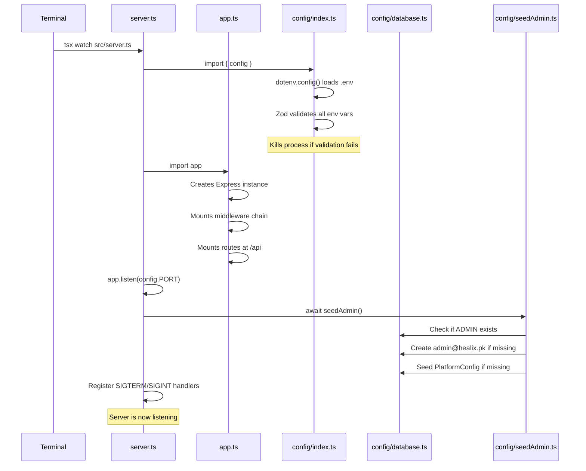
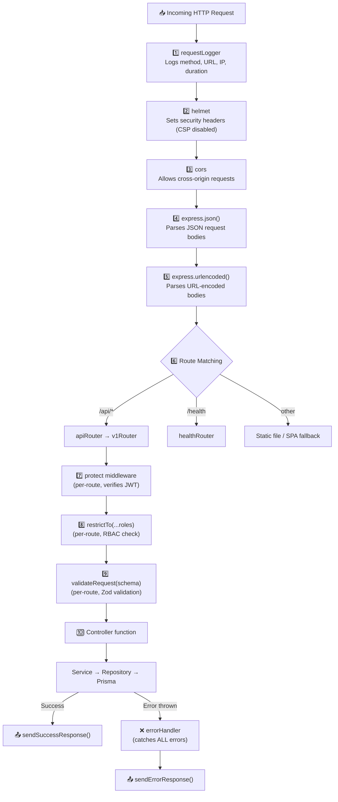
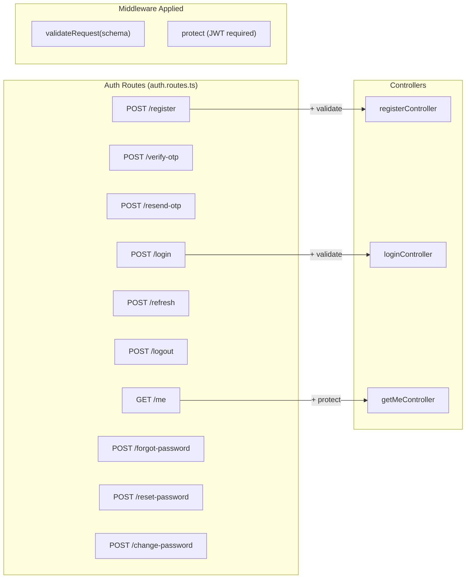
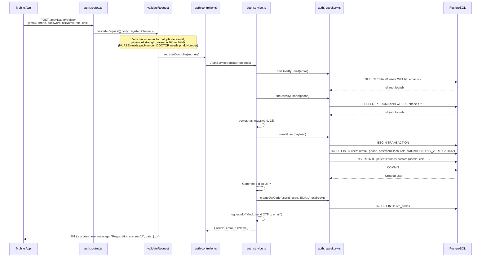
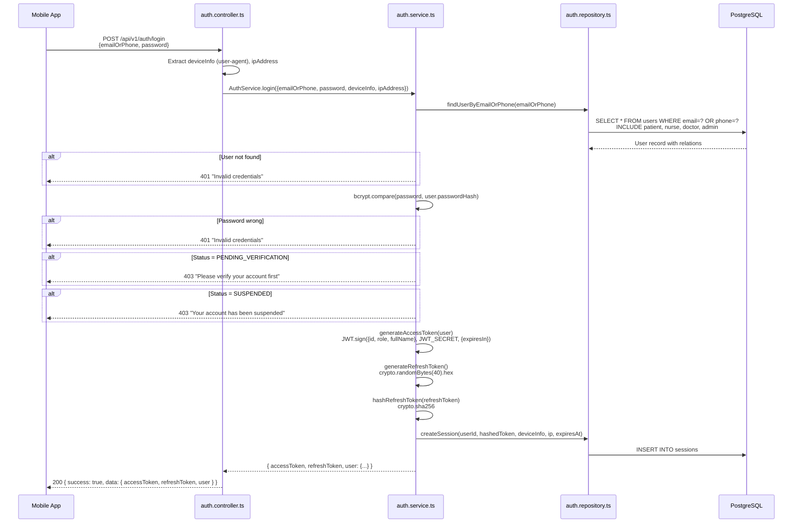
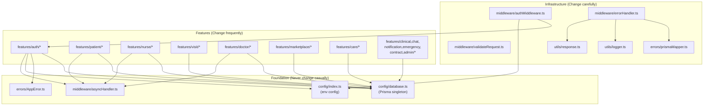

# 🔵 Healix — Lesson 2: The Backend Deep-Dive

> **Objective**: After this lesson you will understand every file in the backend, how the middleware pipeline works, how every feature module is structured, and you'll be able to trace any API request from HTTP entry to database query and back.

---

## 2.1 — The Boot Sequence

When you run `pnpm backend:dev`, the system executes `tsx watch src/server.ts`. Here's what happens:



### The Two Entry Files

| File | Role | Analogy |
|---|---|---|
| [server.ts](file:///f:/class%20Data/FYP%20Project/Proposal/Project/Healix/backend/src/server.ts) | **Process manager** — starts the HTTP listener, seeds admin, handles graceful shutdown and crash recovery | The building manager who opens/closes the building |
| [app.ts](file:///f:/class%20Data/FYP%20Project/Proposal/Project/Healix/backend/src/app.ts) | **Application configurator** — wires up middleware, routes, static files, error handler | The architect who designed the building's layout |

> [!WARNING]
> **If you change `server.ts`**: You're affecting process lifecycle (shutdown, crash handling). Changes here can cause data corruption if Prisma disconnects improperly.
>
> **If you change `app.ts`**: You're affecting ALL requests. Adding/removing/reordering middleware here impacts every single API endpoint and the web dashboard serving.

---

## 2.2 — The Middleware Pipeline (Exact Order)

Every HTTP request passes through this exact chain, defined in [app.ts](file:///f:/class%20Data/FYP%20Project/Proposal/Project/Healix/backend/src/app.ts):



> [!IMPORTANT]
> Middleware 1–5 run on **every** request (global). Middleware 7–9 are **per-route** — each feature's `*.routes.ts` decides which routes need auth, which roles are allowed, and which Zod schema validates the body.

---

## 2.3 — The Common Layer (Infrastructure)

The `backend/src/common/` folder contains the **cross-cutting infrastructure** that every feature depends on. Think of it as the foundation of the building — you don't touch it often, but everything stands on it.

```
common/
├── config/           ← Environment, database, startup seeding
│   ├── index.ts      ← Env validation (Zod)
│   ├── database.ts   ← Prisma singleton
│   └── seedAdmin.ts  ← Auto-create admin on first boot
├── constants/        ← Global constants
│   └── index.ts      ← HTTP codes, auth limits, pagination defaults
├── errors/           ← Error infrastructure
│   ├── AppError.ts   ← Custom error class
│   └── prismaMapper.ts ← Translates DB errors to HTTP errors
├── middleware/        ← Request pipeline
│   ├── adminAuth.ts      ← Admin-only standalone guard
│   ├── asyncHandler.ts   ← Async error wrapper
│   ├── authMiddleware.ts ← JWT verify + RBAC (protect, restrictTo)
│   ├── errorHandler.ts   ← Global error interceptor
│   ├── requestLogger.ts  ← HTTP request logging
│   └── validateRequest.ts ← Zod schema validation
└── utils/            ← Shared helpers
    ├── logger.ts      ← Winston logger instance
    ├── pagination.ts  ← skip/take + metadata calculation
    ├── queryHelper.ts ← Sort and search param parsing
    ├── response.ts    ← Standardized JSON responses
    └── transaction.ts ← Prisma transaction wrapper
```

### 2.3.1 — Config Files

#### [config/index.ts](file:///f:/class%20Data/FYP%20Project/Proposal/Project/Healix/backend/src/common/config/index.ts) — Environment Validation
- **What**: Loads `.env` via dotenv, validates with Zod, exports typed `config` object
- **Exports**: `config` (with `PORT`, `NODE_ENV`, `DATABASE_URL`, `JWT_SECRET`, `JWT_EXPIRES_IN`, `JWT_REFRESH_SECRET`, `JWT_REFRESH_EXPIRES_IN`)
- **Who uses it**: Almost everything — server.ts, auth service, middleware, logger
- **⚠️ Impact**: If you change the Zod schema here and a required env var is missing, the **server will refuse to start** (calls `process.exit(1)`)
- **Safety**: Rarely modify. Only change when adding new env vars.

#### [config/database.ts](file:///f:/class%20Data/FYP%20Project/Proposal/Project/Healix/backend/src/common/config/database.ts) — Prisma Singleton
- **What**: Creates a single `PrismaClient` instance with query logging piped to Winston
- **Exports**: `prisma` (singleton)
- **Who uses it**: Every repository file, seedAdmin, transactions
- **⚠️ Impact**: Changing this affects **all database access** across the entire backend
- **Safety**: Almost never modify. Only change for connection pool tuning or logging changes.

#### [config/seedAdmin.ts](file:///f:/class%20Data/FYP%20Project/Proposal/Project/Healix/backend/src/common/config/seedAdmin.ts) — Startup Seeding
- **What**: On server boot, ensures admin user (`admin@healix.pk` / `Admin@1234`) and default `PlatformConfig` records exist
- **Exports**: `seedAdmin()` function
- **Who calls it**: `server.ts` on startup
- **⚠️ Impact**: If you change the admin credentials here, you'll need to delete the existing admin record from the DB first
- **Safety**: Modify carefully — this runs on every server start

### 2.3.2 — Constants

#### [constants/index.ts](file:///f:/class%20Data/FYP%20Project/Proposal/Project/Healix/backend/src/common/constants/index.ts)
- **Exports** (`as const`):
  - `HTTP_STATUS` — All standard HTTP codes (200, 201, 400, 401, 403, 404, 409, 500)
  - `AUTH_CONSTANTS` — OTP expiry times, max attempts, lockout durations
  - `PAGINATION_DEFAULTS` — Default page size, max page size
- **Who uses it**: Controllers, services, error handler, pagination utility
- **Safety**: Safe to extend (add new constants), risky to modify existing values

### 2.3.3 — Error System

#### [errors/AppError.ts](file:///f:/class%20Data/FYP%20Project/Proposal/Project/Healix/backend/src/common/errors/AppError.ts) — Custom Error Class
```typescript
class AppError extends Error {
  statusCode: number;      // HTTP status to return
  isOperational: boolean;  // true = expected error, false = bug
  errors: any;             // Additional error details
}
```
- **Used by**: Every service that needs to throw a meaningful error
- **Example**: `throw new AppError('Patient not found', 404)`
- **Safety**: Almost never modify — changing the constructor signature breaks every `throw new AppError()` in the codebase

#### [errors/prismaMapper.ts](file:///f:/class%20Data/FYP%20Project/Proposal/Project/Healix/backend/src/common/errors/prismaMapper.ts) — Database Error Translator
- **What**: Converts raw Prisma error codes into clean `AppError` instances
- **Mappings**:
  | Prisma Code | HTTP Status | Meaning |
  |---|---|---|
  | `P2002` | 409 Conflict | Unique constraint violation (duplicate email, etc.) |
  | `P2025` | 404 Not Found | Record not found |
  | `P2003` | 400 Bad Request | Foreign key constraint failure |
  | `P2014` | 400 Bad Request | Relation constraint violation |
- **Who calls it**: `errorHandler` middleware and `withTransaction` utility
- **Safety**: Safe to extend with new codes. Modifying existing mappings changes error responses globally.

### 2.3.4 — Middleware (The Pipeline Components)

#### [asyncHandler.ts](file:///f:/class%20Data/FYP%20Project/Proposal/Project/Healix/backend/src/common/middleware/asyncHandler.ts)
- **What**: Wraps async route handlers so rejected promises automatically go to `next(error)` instead of crashing
- **Why it exists**: Express doesn't natively catch async errors — without this, unhandled rejections would crash the server
- **Who uses it**: Every controller is wrapped: `asyncHandler(async (req, res) => { ... })`
- **Safety**: Never modify — it's 5 lines of code and everything depends on it

#### [authMiddleware.ts](file:///f:/class%20Data/FYP%20Project/Proposal/Project/Healix/backend/src/common/middleware/authMiddleware.ts) — The Auth Guard
- **Exports**:
  - `protect` — Verifies JWT, loads user from DB, blocks suspended users, attaches `req.user`
  - `restrictTo(...roles)` — Factory function that returns middleware checking `req.user.role`
- **Logic flow of `protect`**:
  ```
  1. Extract Bearer token from Authorization header → 401 if missing
  2. jwt.verify(token, JWT_SECRET) → 401 if expired/invalid
  3. AuthRepository.findUserById(decoded.id) → 401 if user deleted
  4. Check user.status !== 'SUSPENDED' → 403 if suspended
  5. Attach user to req.user → call next()
  ```
- **Who uses it**: Every protected route in every feature
- **⚠️ Impact**: Changing this changes auth for the entire application

#### [adminAuth.ts](file:///f:/class%20Data/FYP%20Project/Proposal/Project/Healix/backend/src/common/middleware/adminAuth.ts)
- **What**: Standalone admin-only middleware (alternative to `restrictTo('ADMIN')`)
- **Why it exists separately**: Used by the web admin dashboard routes which need a simpler, self-contained guard
- **Safety**: Changing this only affects admin-specific routes

#### [validateRequest.ts](file:///f:/class%20Data/FYP%20Project/Proposal/Project/Healix/backend/src/common/middleware/validateRequest.ts)
- **What**: Middleware factory that validates `req.body`, `req.query`, and `req.params` against Zod schemas
- **How it's used**: In routes files: `router.post('/register', validateRequest({ body: registerSchema }), registerController)`
- **Key detail**: After validation, it **overwrites** `req.body/query/params` with the parsed output (stripping unknown fields)
- **Safety**: Rarely modify — changes affect all validation globally

#### [errorHandler.ts](file:///f:/class%20Data/FYP%20Project/Proposal/Project/Healix/backend/src/common/middleware/errorHandler.ts) — The Safety Net
- **What**: Catches ALL errors thrown anywhere in the request pipeline
- **Processing order**:
  1. Pass error through `mapPrismaError()` (converts DB errors)
  2. Log via Winston
  3. If `AppError` → respond with its `statusCode` and message
  4. If `ZodError` → map to field-level validation errors, respond 400
  5. If unknown → respond 500 (expose message only in dev mode)
- **Safety**: Modify carefully — this is the last line of defense against unhandled errors

#### [requestLogger.ts](file:///f:/class%20Data/FYP%20Project/Proposal/Project/Healix/backend/src/common/middleware/requestLogger.ts)
- **What**: Logs every HTTP request's method, URL, IP, status code, and duration
- **Color coding**: 500+ = error, 400-499 = warn, else = http level
- **Safety**: Safe to modify — only affects logging, not functionality

### 2.3.5 — Utilities

| File | What It Does | Key Exports | Used By |
|---|---|---|---|
| `logger.ts` | Winston logger with dev (colorized) and prod (JSON) formats | `logger` | Everything |
| `pagination.ts` | Converts `?page=2&limit=10` into Prisma `skip/take` + metadata | `getPaginationParams`, `formatPaginationMetadata` | Controllers with list endpoints |
| `queryHelper.ts` | Parses `?sort=name&order=asc&search=john` into Prisma clauses | `getSortParams`, `getSearchParams` | Controllers with searchable lists |
| `response.ts` | Standardized JSON response format | `sendSuccessResponse`, `sendErrorResponse` | Every controller |
| `transaction.ts` | Wraps Prisma `$transaction` with error mapping | `withTransaction` | Services needing atomic operations |

### Response Format (Every API Response Looks Like This)

```json
// Success
{
  "success": true,
  "message": "Patient profile updated successfully",
  "data": { /* ... */ }
}

// Error
{
  "success": false,
  "message": "Validation failed",
  "errors": [
    { "field": "email", "message": "Invalid email format" }
  ]
}
```

---

## 2.4 — The Feature Architecture (Traced Through Auth)

Now let's see exactly how a real feature works. We'll trace the **auth module** — the most important feature — from route definition to database query.

### File Structure
```
features/auth/
├── index.ts              ← Re-exports the router (barrel file)
├── auth.routes.ts        ← URL → middleware → controller mapping
├── auth.validation.ts    ← Zod schemas for each endpoint
├── auth.types.ts         ← TypeScript interfaces
├── auth.controller.ts    ← Request handling (thin layer)
├── auth.service.ts       ← Business logic (thick layer)
└── auth.repository.ts    ← Database access (Prisma queries)
```

### Complete Route Map



### Tracing: User Registration (End to End)

Let's follow a registration request from HTTP to database:



### Tracing: User Login (End to End)



### Key Auth Business Rules

| Rule | Implementation | Location |
|---|---|---|
| Email AND phone must be unique | Check before creating user | `auth.service.ts → register()` |
| Password hashed with bcrypt (12 rounds) | `bcrypt.hash(password, 12)` | `auth.service.ts → register()` |
| OTP is 6-digit, expires in 10 minutes | Random number, stored with `expiresAt` | `auth.service.ts → register()` |
| Max 5 OTP resends per hour | `countRecentOtps()` rate limit | `auth.service.ts → resendOtp()` |
| PATIENT auto-activates on OTP verify | Status → ACTIVE | `auth.service.ts → verifyOtp()` |
| NURSE/DOCTOR stays PENDING after OTP | Needs admin credential approval | `auth.service.ts → verifyOtp()` |
| Refresh token is SHA-256 hashed before storage | Never stored in plaintext | `auth.service.ts → hashRefreshToken()` |
| Password reset revokes ALL sessions | Atomic transaction | `auth.service.ts → resetPassword()` |

---

## 2.5 — Complete Feature Catalog

Every feature follows the same 5-layer pattern. Here's what each one does:

### 🔐 Auth (`/api/v1/auth`)
**Purpose**: Registration, login, OTP verification, JWT management, password reset
**Key endpoints**: `/register`, `/login`, `/verify-otp`, `/refresh`, `/me`, `/change-password`

---

### 👤 Patient (`/api/v1/patients`)
**Purpose**: Patient profiles, medical history, care requests, health vault
**Key endpoints**: `/:id/profile`, `/:id/medical-history`, `/requests`, `/:id/dashboard`, `/:id/vitals-history`
**Key business rules**:
- Ownership check: Patients can only access their own data (unless ADMIN)
- Care request creation auto-creates: `Visit` (SCHEDULED) + `Payment` (PENDING) + `MarketplaceListing` (OPEN)
- Cancellation cascades: Cancels listing, visits, payments, and rejects pending offers
- Reschedule blocked if < 2 hours before scheduled time
- Mock geolocation: Address updates generate random Islamabad coordinates

---

### 👩‍⚕️ Nurse (`/api/v1/nurses`)
**Purpose**: Nurse profiles, credential verification, availability management, earnings
**Key endpoints**: `/:id/profile`, `/:id/verification/upload`, `/:id/availability`, `/:id/earnings`
**Key business rules**:
- Cannot set `available=true` without photo, bio (≥20 chars), and ≥1 qualification
- Document verification requires 5 specific types (CNIC front/back, license, degree, background check)
- All 5 documents approved → nurse auto-activates
- Availability slots checked for time overlap on same day

---

### 🩺 Visit (`/visits`)
**Purpose**: Full visit lifecycle — accept, verify, start, record vitals, complete, review
**Key endpoints**: `/visits/:id/accept`, `/start`, `/complete`, `/verify-qr`, `/verify-gps`, `/vitals`, `/symptoms`, `/clinical-remarks`
**Key business rules**:
- **5-minute expiry**: Pending visits expire if not accepted within 5 minutes
- **Start requires verification**: At least one successful QR, GPS, or manual verification
- **QR verification**: Token must match `base64(visitId:requestId)`
- **GPS verification**: Haversine distance must be ≤ 150 meters
- **Clinical remarks auto-escalate**: Confidence ≤ 2 → HIGH risk → auto-creates `CaseAssignment` with 20-min SLA
- **Completion auto-computes**: Nurse score (skill + experience + reliability + performance) and awards badges

---

### 🏥 Care (`/care-requests`, `/scheduling`, `/assignment`)
**Purpose**: Care request management, scheduling, nurse assignment, compliance tracking
**Key business rules**:
- **Deduplication**: Requests within 2-hour window of same type are merged
- **Auto-assignment**: Parses `[SPECIALTY:X]` from notes, finds available verified nurses, ranks by composite score, falls back to `[MARKETPLACE_FALLBACK]` if none eligible
- **Recurring visits**: Generates up to 4 weeks of visits in advance
- **Compliance metrics**: Trailing 30-day visit and medication compliance percentages

---

### 🛒 Marketplace (`/marketplace`)
**Purpose**: Nurse bidding system where nurses bid on open care requests
**Key business rules**:
- **PII masking**: Patient names truncated (John Doe → John D.), addresses show zone only
- **Best match scoring**: Price (40%) + Rating (40%) + Specialty match (20%)
- **Offer selection** triggers atomic transaction: close listing → accept offer → reject others → assign nurse to visit → generate contract
- **Cost preview**: Calculates hourly/daily/fixed cost + platform fee (default 10%)

---

### 📜 Contract (`/contracts`)
**Purpose**: Formal service agreements between patients and nurses
**Key business rules**:
- Auto-generated when marketplace offer is selected
- 24-hour expiry if not approved
- Requires dual approval (both patient AND nurse must approve)
- Both approvals → status transitions to ACTIVE
- Full audit trail via `ContractAuditLog`

---

### 🧬 Clinical (`/clinical`)
**Purpose**: AI-powered risk assessment, clinical knowledge queries, visit summaries
**Key business rules**:
- **Risk score formula**: ML Score (45%) + Vitals Deviation (30%) + Nurse Confidence (20%) + NLP Sentiment (10%)
- **HIGH risk auto-escalates**: Creates `CaseAssignment` with 2-hour SLA deadline
- **Knowledge query**: RAG-style keyword matching against `ClinicalKnowledgeEntry` table
- **Visit summary**: Generates text recommendations from vitals thresholds (SpO2 < 92, temp > 38.5°C, etc.)

---

### 👨‍⚕️ Doctor (`/doctors`, `/cases`)
**Purpose**: Doctor queue management, case review, diagnosis, prescriptions, home visits
**Key business rules**:
- **SLA tracking**: Remaining minutes calculated from `slaDeadline`
- **Allergy safety check**: Prescriptions cross-checked against patient allergies → 409 Conflict if match found (with `bypassAllergyCheck` override)
- **Diagnosis versioning**: Subsequent diagnoses increment version, reference parent
- **CDSS mock advisory**: Respiratory symptoms → suggest SpO2, Cardiovascular → suggest BP/ECG
- **Clinical decisions**: `REQUEST_EMERGENCY` decision can auto-dispatch ambulance

---

### 🚨 Emergency (`/escalation`, `/dispatch`, `/admission`)
**Purpose**: Three-phase emergency pipeline
**Sub-modules**:

| Phase | Purpose |
|---|---|
| **Escalation** | Assigns doctor to high-risk case, creates nurse-doctor chat thread, broadcasts to all verified doctors |
| **Dispatch** | Recommends hospitals (Haversine distance, affordability tiers, capacity), dispatches ambulance with ETA tracking |
| **Admission** | Tracks REQUESTED → ADMITTED → DISCHARGED. On discharge, auto-creates follow-up `CareRequest` for next day |

---

### 💬 Chat (`/chat`)
**Purpose**: AI chat and peer-to-peer messaging
**Key business rules**:
- **AI chat SOS**: Severe keywords ("chest pain", "unconscious") auto-create `EmergencyEvent` + push/SMS notification
- **Access windows**: Patient-nurse chat blocked if > 7 days past completed visit/contract
- **Admin audit**: If admin accesses chat and active dispute exists, creates `AdminAuditLog` entry

---

### 🔔 Notification (`/notifications`)
**Purpose**: Push, SMS, and in-app notifications with preference management
**Key business rules**:
- **5-minute deduplication**: Sliding window prevents duplicate notifications
- **Quiet hours**: Respects user preferences (timezone-aware)
- **EMERGENCY overrides everything**: Bypasses mute settings and quiet hours, sends PUSH + SMS simultaneously

---

### 🛡️ Admin (`/api/v1/admin`)
**Purpose**: Platform management — user moderation, credential approval, config, audit
**Key business rules**:
- **Self-protection**: Admins cannot suspend/delete other admins
- **Session invalidation**: Suspend/delete immediately revokes all user sessions
- **Doctor revocation**: Auto-flags active cases back to PENDING for re-escalation
- **Config masking**: Sensitive keys (containing "secret"/"password") are masked in API responses
- **Audit export**: CSV generation for compliance

---

### ❤️ Health (`/health`)
**Purpose**: Simple health check — returns uptime and timestamp. Used by monitoring tools.

---

## 2.6 — Dependency Tree (Who Depends On What)



### Modification Impact Matrix

| If you change... | What breaks? | Review scope |
|---|---|---|
| `config/database.ts` | ALL database access | Every repository file |
| `config/index.ts` | Server startup, any code reading config | Entire backend |
| `errors/AppError.ts` | Every `throw new AppError()` | Every service file |
| `middleware/authMiddleware.ts` | ALL authenticated routes | Every route and frontend auth |
| `middleware/errorHandler.ts` | ALL error responses | Frontend error handling |
| `middleware/validateRequest.ts` | ALL request validation | Every route with validation |
| `utils/response.ts` | ALL API response format | Frontend stores parsing responses |
| `prisma/schema.prisma` | Database structure, all Prisma queries | Every repository, every migration |
| Any `*.routes.ts` | Only that feature's endpoints | Corresponding frontend store |
| Any `*.service.ts` | Only that feature's business logic | Corresponding controller and tests |
| Any `*.repository.ts` | Only that feature's DB queries | Corresponding service |

---

## 2.7 — How to Add a New Backend Feature

If you need to add a new feature (e.g., "Insurance"), follow this exact recipe:

```
1. Create folder: backend/src/features/insurance/
2. Create files:
   ├── insurance.routes.ts       ← Define endpoints
   ├── insurance.validation.ts   ← Define Zod schemas
   ├── insurance.controller.ts   ← Handle requests
   ├── insurance.service.ts      ← Business logic
   ├── insurance.repository.ts   ← Prisma queries
   ├── insurance.types.ts        ← TypeScript interfaces
   └── index.ts                  ← Re-export router
3. Add Prisma model to schema.prisma
4. Run: pnpm prisma:migrate
5. Register router in routes/v1.ts:
   import insuranceRouter from '../features/insurance';
   router.use('/insurance', insuranceRouter);
```

---

## ✅ Lesson 2 Complete

You now understand:
- The exact server boot sequence
- The middleware pipeline order and each middleware's job
- All 17 common infrastructure files and their roles
- The 5-layer feature pattern traced through Auth (registration + login)
- All 14 feature modules and their key business rules
- The dependency tree and modification impact matrix
- How to add a new backend feature

> **Next Lesson (Lesson 3)** will dive deep into the **Frontend** — Expo Router navigation, Zustand stores, component architecture, the mobile screen-by-screen walkthrough, and data flow from UI to API for each role.

**Reply "continue" when you're ready for Lesson 3.**
