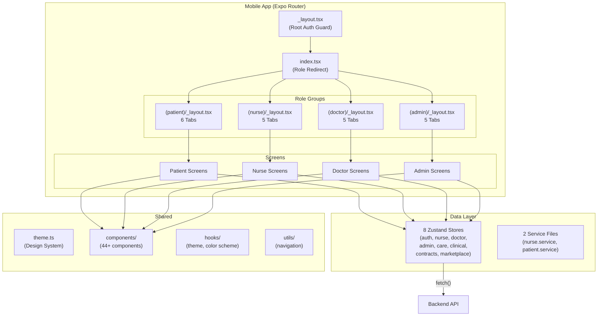
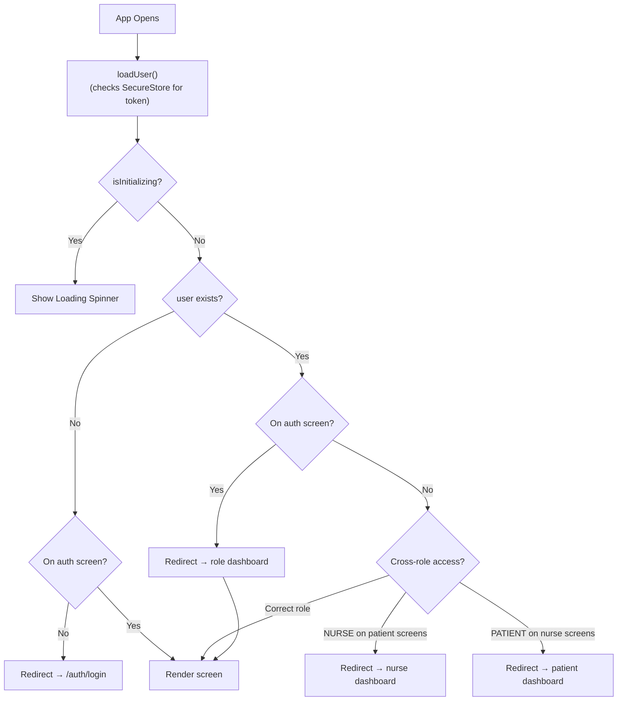
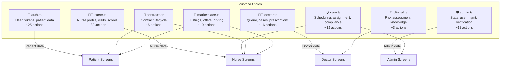
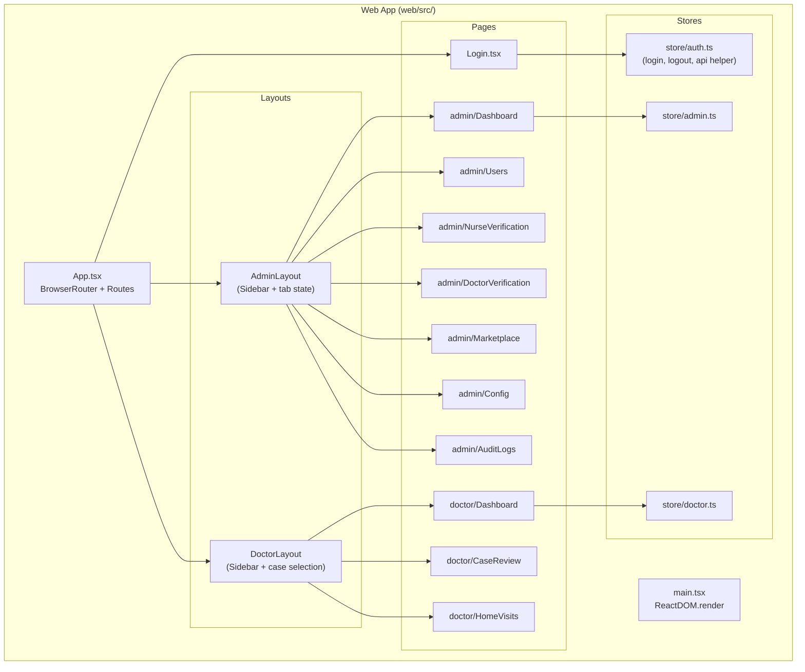
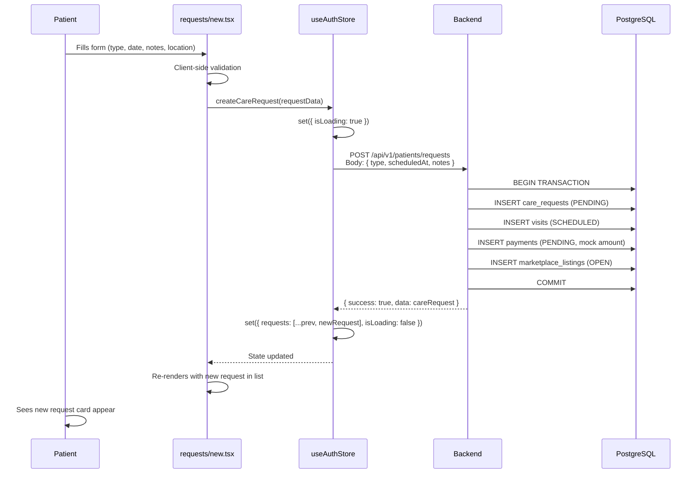
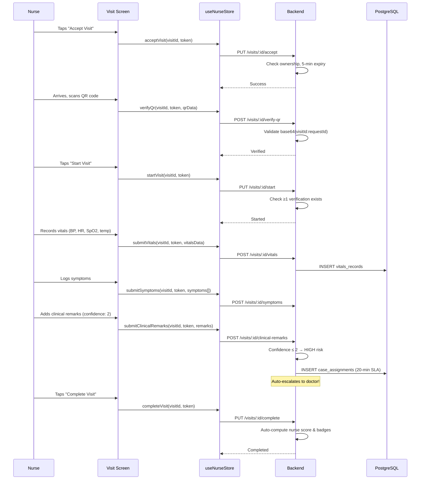
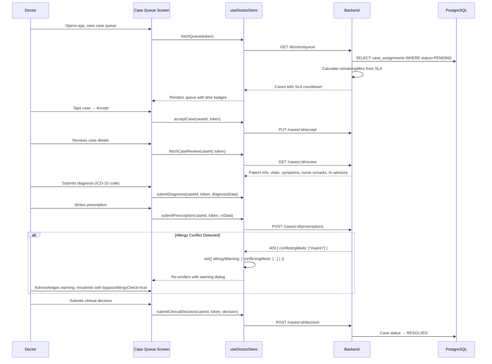

# 📱 Healix — Lesson 3: The Frontend Deep-Dive

> **Objective**: After this lesson you will understand how Expo Router navigation works, how every screen connects to its Zustand store, how data flows from UI to API and back, and you'll be able to confidently add new screens, stores, and components.

---

## 3.1 — Frontend Architecture Overview



### The Three Layers of the Frontend

| Layer | What | Files | Analogy |
|---|---|---|---|
| **Navigation** | File-based routes + layouts | `src/app/**/*.tsx` | The building's corridors and doors |
| **Data** | Zustand stores + services | `src/store/*.ts`, `src/services/*.ts` | The building's plumbing and wiring |
| **UI** | Components + theme | `src/components/**/*.tsx`, `src/theme.ts` | The building's furniture and paint |

---

## 3.2 — Expo Router Navigation System

Healix uses **file-based routing** via Expo Router. The folder structure inside `src/app/` directly maps to URL routes:

```
src/app/
├── _layout.tsx              →  Root wrapper (runs on EVERY screen)
├── index.tsx                →  / (initial redirect)
├── auth/
│   ├── login.tsx            →  /auth/login
│   ├── register.tsx         →  /auth/register
│   ├── role-select.tsx      →  /auth/role-select
│   ├── verify-otp.tsx       →  /auth/verify-otp
│   ├── forgot.tsx           →  /auth/forgot
│   ├── reset.tsx            →  /auth/reset
│   └── change-password.tsx  →  /auth/change-password
├── (patient)/
│   ├── _layout.tsx          →  Tab navigator for patients
│   ├── home/index.tsx       →  /(patient)/home
│   ├── requests/index.tsx   →  /(patient)/requests
│   ├── requests/new.tsx     →  /(patient)/requests/new
│   ├── health/index.tsx     →  /(patient)/health
│   ├── ai/index.tsx         →  /(patient)/ai
│   ├── messages/index.tsx   →  /(patient)/messages
│   ├── profile/index.tsx    →  /(patient)/profile
│   └── records/             →  /(patient)/records/*
├── (nurse)/
│   ├── _layout.tsx          →  Tab navigator for nurses
│   ├── home/index.tsx       →  /(nurse)/home
│   ├── visits/              →  /(nurse)/visits/*
│   ├── marketplace/         →  /(nurse)/marketplace
│   ├── messages/            →  /(nurse)/messages
│   └── profile/             →  /(nurse)/profile
├── (doctor)/
│   ├── _layout.tsx          →  Tab navigator for doctors
│   ├── home/index.tsx       →  /(doctor)/home
│   ├── reviews/             →  /(doctor)/reviews
│   ├── diagnosis/           →  /(doctor)/diagnosis
│   ├── messages/            →  /(doctor)/messages
│   └── profile/             →  /(doctor)/profile
├── (admin)/
│   └── _layout.tsx          →  Tab navigator for admin (mobile)
└── admin/
    ├── index.tsx             →  /admin (dashboard)
    ├── users.tsx             →  /admin/users
    ├── nurses.tsx            →  /admin/nurses
    ├── doctors.tsx           →  /admin/doctors
    └── config.tsx            →  /admin/config
```

### Key Concepts

| Concept | Explanation |
|---|---|
| `_layout.tsx` | A **wrapper** that renders around all sibling routes. Used for navigation containers (tabs, drawers) and auth guards. |
| `(group)/` | **Route groups** (parentheses). Groups routes without adding a URL segment. `(patient)/home` → URL is `/home` within the patient group. |
| `index.tsx` | The **default route** for a folder. `home/index.tsx` → `/home`. |
| `[param].tsx` | **Dynamic routes**. `requests/[id].tsx` → `/requests/abc123`. |

---

## 3.3 — The Auth Guard (Root Layout)

[_layout.tsx](file:///f:/class%20Data/FYP%20Project/Proposal/Project/Healix/mobile/src/app/_layout.tsx) is the **most critical frontend file**. It runs on every single screen and enforces authentication and RBAC:



### The Three Protections

1. **Unauthenticated users** → Forced to `/auth/login`
2. **Authenticated users on auth screens** → Redirected to their role dashboard
3. **Cross-role access** → NURSE can't access `(patient)/*`, PATIENT can't access `(nurse)/*`, etc.
   - Exception: **ADMIN can access everything** (the guard allows ADMIN into nurse/doctor/patient groups)

> [!WARNING]
> **If you modify `_layout.tsx`**: You can accidentally lock users out of the entire app, create infinite redirect loops, or break role-based access. Test every role after any change.

---

## 3.4 — Role-Based Tab Navigation

Each role has its own `_layout.tsx` that defines their tab navigator:

### Patient Tabs — [_layout.tsx](file:///f:/class%20Data/FYP%20Project/Proposal/Project/Healix/mobile/src/app/(patient)/_layout.tsx)
| Tab | Icon | Screen | Purpose |
|---|---|---|---|
| Home | 🏠 | `home/index.tsx` | Dashboard, vitals, upcoming visits |
| Request | 📋 | `requests/index.tsx` | View/create care requests |
| Health | 💚 | `health/index.tsx` | Health vault (vitals, conditions, care plans) |
| AI | 🤖 | `ai/index.tsx` | AI health assistant chat |
| Messages | 💬 | `messages/index.tsx` | Chat with nurses/doctors |
| Profile | 👤 | `profile/index.tsx` | Account settings, logout |

**Hidden screens** (accessible via navigation but not in tab bar): `records/*`, `explore/*`, `notifications/*`

### Nurse Tabs — [_layout.tsx](file:///f:/class%20Data/FYP%20Project/Proposal/Project/Healix/mobile/src/app/(nurse)/_layout.tsx)
| Tab | Icon | Screen | Purpose |
|---|---|---|---|
| Dashboard | 🏠 | `home/index.tsx` | Score, reviews, assigned visits |
| Visits | 📅 | `visits/` | Accept/start/complete visits |
| Bids | 🌐 | `marketplace/` | Browse & bid on care requests |
| Messages | 💬 | `messages/` | Chat with patients/doctors |
| Profile | 👤 | `profile/` | Credentials, availability, earnings |

**Hidden screens**: `patients/*`, `schedule/*`, `sync/*`

### Doctor Tabs — [_layout.tsx](file:///f:/class%20Data/FYP%20Project/Proposal/Project/Healix/mobile/src/app/(doctor)/_layout.tsx)
| Tab | Icon | Screen | Purpose |
|---|---|---|---|
| Cases | 🏠 | `home/index.tsx` | SLA-tracked case queue |
| Reviews | 🩺 | `reviews/` | Home visits management |
| Diagnosis | 📋 | `diagnosis/` | Clinical decision tools |
| Messages | 💬 | `messages/` | Nurse-doctor threads |
| Profile | 👤 | `profile/` | PMDC credentials |

### Admin Tabs — [_layout.tsx](file:///f:/class%20Data/FYP%20Project/Proposal/Project/Healix/mobile/src/app/(admin)/_layout.tsx)
| Tab | Icon | Screen | Purpose |
|---|---|---|---|
| Dashboard | 📊 | `admin/index.tsx` | System analytics |
| Users | 👥 | `admin/users.tsx` | User management |
| Nurses | 👩‍⚕️ | `admin/nurses.tsx` | PNC verification |
| Doctors | 👨‍⚕️ | `admin/doctors.tsx` | PMDC verification |
| Config | ⚙️ | `admin/config.tsx` | Platform settings |

> [!NOTE]
> All layouts are **responsive**. On web/tablet, they render a **Sidebar** instead of bottom tabs. The same `_layout.tsx` handles both via `Platform` or `Dimensions` checks.

---

## 3.5 — Zustand Stores (The App's Brain)

The stores are the **single most important part of the frontend**. They hold ALL state and contain ALL API call logic. There are **8 stores**, each serving a specific domain:



### Store Architecture Pattern

Every store follows the **exact same pattern**:

```typescript
export const useXxxStore = create<XxxState>((set, get) => ({
  // 1. STATE FIELDS (reactive data)
  someData: null,
  isLoading: false,
  error: null,

  // 2. ACTION FUNCTIONS (contain fetch + state updates)
  fetchSomeData: async (token: string) => {
    set({ isLoading: true, error: null });
    try {
      const res = await fetch(`${API_URL}/endpoint`, {
        headers: { 'Authorization': `Bearer ${token}` }
      });
      const data = await res.json();
      if (!data.success) throw new Error(data.message);
      set({ someData: data.data, isLoading: false });
    } catch (err: any) {
      set({ error: err.message, isLoading: false });
    }
  },
}));
```

### The API_URL Resolution

All stores use a shared `getApiUrl()` function that determines the backend URL:

| Platform | URL |
|---|---|
| Web browser | `http://localhost:3000/api/v1` |
| Android emulator | `http://10.0.2.2:3000/api/v1` |
| Physical device | `http://<expo-host-ip>:3000/api/v1` |

### Token Management Patterns

| Store | How Token Is Accessed |
|---|---|
| `auth.ts` | Uses `get().accessToken` internally (it owns the token) |
| All other stores | Token is **passed as an argument** by the calling screen |

This means screens do:
```typescript
const { accessToken } = useAuthStore();
const { fetchNurseProfile } = useNurseStore();

useEffect(() => {
  if (accessToken) fetchNurseProfile(nurseId, accessToken);
}, []);
```

---

## 3.6 — Store-by-Store Reference

### 🔐 auth.ts — The Master Store (Largest, ~25 Actions)

This store is **unique** — it owns the user session AND all patient-specific data:

| State Field | Type | Purpose |
|---|---|---|
| `user` | User \| null | Currently logged-in user |
| `accessToken` | string \| null | JWT token for API calls |
| `patientProfile` | PatientProfile \| null | Patient's extended profile |
| `medicalHistory` | MedicalHistory \| null | Conditions, allergies, medications |
| `requests` | CareRequest[] | Patient's care requests |
| `prescriptions` | Prescription[] | Patient's prescriptions |
| `vitalsHistory` | VitalsRecord[] | Patient's vitals timeline |
| `riskHistory` | RiskAssessment[] | Patient's risk scores |
| `dashboardSummary` | DashboardSummary \| null | Aggregated dashboard data |
| `carePlans` | CarePlan[] | Active care plans |
| `caregivers` | CaregiverLink[] | Linked caregivers |
| `isInitializing` | boolean | True during initial load |
| `isLoading` | boolean | True during any API call |
| `error` | string \| null | Last error message |

**Key actions**: `register`, `verifyOtp`, `login`, `logout`, `loadUser`, `fetchPatientProfile`, `updatePatientProfile`, `fetchMedicalHistory`, `addChronicCondition`, `addAllergy`, `addMedication`, `createCareRequest`, `cancelCareRequest`, `fetchDashboardSummary`, `forgotPassword`, `resetPassword`, `changePassword`

> [!IMPORTANT]
> The auth store is a **"god store"** for the patient role — it holds both authentication state AND patient feature data. This is a design decision: since patient is the default role and most of the data is tied to the authenticated user, it lives together.

### 👩‍⚕️ nurse.ts — The Nurse Workhorse (~32 Actions)

| State Field | Type | Purpose |
|---|---|---|
| `nurseProfile` | NurseProfile \| null | Nurse's profile with qualifications |
| `verificationStatus` | VerificationStatus \| null | Document verification progress |
| `slots` | AvailabilitySlot[] | Weekly availability |
| `earnings` | NurseEarnings \| null | Total/pending earnings |
| `assignedVisits` | AssignedVisit[] | Current visit queue |
| `selectedVisit` | AssignedVisit \| null | Visit detail being viewed |
| `nurseScore` | NurseScore \| null | Composite performance score |
| `nurseReviews` | NurseReview[] | Patient reviews |
| `nurseBadges` | NurseBadge[] | Achievement badges |
| `vacations` | NurseVacation[] | Scheduled time off |

**Covers the entire visit lifecycle**: `acceptVisit` → `startVisit` → `verifyQr`/`verifyGps`/`verifyManual` → `submitVitals` → `submitSymptoms` → `submitClinicalRemarks` → `completeVisit` → `submitReview`

### 👨‍⚕️ doctor.ts (~16 Actions)

| State Field | Type | Purpose |
|---|---|---|
| `queue` | CaseAssignment[] | Pending cases with SLA |
| `highRiskQueue` | CaseAssignment[] | High-risk filtered queue |
| `selectedCaseReview` | CaseReviewPayload \| null | Detailed case data |
| `consultationDoctors` | ConsultationDoctor[] | Available doctors for 2nd opinion |
| `homeVisits` | DoctorHomeVisit[] | Scheduled home visits |
| `allergyWarning` | { conflictingMeds: string[] } \| null | Triggered on prescription conflict |

**Special**: `submitPrescription` catches **409 status** specifically to set `allergyWarning` state, enabling the UI to show an allergy conflict dialog.

### Other Stores (admin, care, clinical, contracts, marketplace)

Follow the same pattern with domain-specific state. See the detailed state interfaces in Lesson 2's feature catalog — each store maps 1:1 to its backend feature module.

---

## 3.7 — Services Layer

Two service files exist as **thin, stateless API wrappers**:

| File | Purpose | Used By |
|---|---|---|
| [patient.service.ts](file:///f:/class%20Data/FYP%20Project/Proposal/Project/Healix/mobile/src/services/patient.service.ts) | Wraps patient/care/AI endpoints | Some patient screens directly (e.g., messages search) |
| [nurse.service.ts](file:///f:/class%20Data/FYP%20Project/Proposal/Project/Healix/mobile/src/services/nurse.service.ts) | Wraps nurse/visit endpoints | Some nurse screens directly |

### Services vs Stores — When Is Each Used?

| Pattern | When Used |
|---|---|
| **Screen → Store → API** | When the result needs to be cached in global state (most cases) |
| **Screen → Service → API** | When the result is used locally and thrown away (e.g., phone search in messages) |

> [!TIP]
> Most data flows through **stores**. Services are used for fire-and-forget operations or one-off queries that don't need global state. When adding new features, default to using a store unless the data is truly ephemeral.

---

## 3.8 — Component Architecture

```
components/
├── common/           ← Shared across ALL roles
├── ui/               ← Generic UI primitives
├── patient/          ← 23 patient-specific components
│   ├── DashboardHeader.tsx
│   ├── HighRiskAlertCard.tsx
│   ├── UpcomingVisitCard.tsx
│   ├── QuickActionsGrid.tsx
│   ├── HealthSummaryCard.tsx
│   ├── RequestCard.tsx
│   ├── RequestFilterPills.tsx
│   ├── VitalsMetricCard.tsx
│   ├── AIChatBubble.tsx
│   ├── ConditionCard.tsx
│   ├── AllergyCard.tsx
│   ├── MedicationCard.tsx
│   ├── PrescriptionCard.tsx
│   ├── AssignedStaffCard.tsx
│   ├── RequestTrackingStepper.tsx
│   └── ... (+ modals, forms)
├── nurse/            ← 21 nurse-specific components
│   ├── NurseDashboardHeader.tsx
│   ├── NurseScoreCard.tsx
│   ├── NurseQuickActions.tsx
│   ├── VisitCard.tsx
│   ├── VisitFilterPills.tsx
│   ├── VitalsEntryForm.tsx
│   ├── SymptomChecklist.tsx
│   ├── OfflineSyncStatusBanner.tsx
│   └── ... (+ verification, review)
├── ShimmerLoader.tsx ← Loading skeleton
├── themed-text.tsx   ← Text with theme colors
├── themed-view.tsx   ← View with theme colors
├── app-tabs.tsx      ← Native tab bar
├── app-tabs.web.tsx  ← Web tab bar (platform-specific)
└── external-link.tsx ← Opens links in browser
```

### Component Design Rules (As Currently Implemented)

1. **Components are presentational** — They receive data via props, not from stores
2. **Screens are smart** — They connect to stores and pass data down to components
3. **Components are role-scoped** — `patient/` components are only used in patient screens, `nurse/` only in nurse screens
4. **No doctor or admin component folders exist** — Those roles use inline UI or reuse common components

---

## 3.9 — The Theme System

[theme.ts](file:///f:/class%20Data/FYP%20Project/Proposal/Project/Healix/mobile/src/theme.ts) defines the entire design language:

| Export | Purpose | Example Values |
|---|---|---|
| `COLORS` | 30+ color tokens | `bg: '#030712'`, `teal: '#0D9488'`, `red: '#EF4444'` |
| `SPACING` | Spacing scale | `xs: 4`, `sm: 8`, `md: 12`, `lg: 16`, `xl: 20` |
| `RADIUS` | Border radius scale | `sm: 8`, `md: 12`, `lg: 16`, `round: 9999` |
| `TYPOGRAPHY` | Font sizes and weights | `sizes.md: 15`, `weights.semibold: '600'` |
| `MOTION` | Animation curves | `springPreset: { tension: 135, friction: 14 }` |
| `ACCESSIBILITY` | Touch targets | `minTouchTarget: 48` |

**Design philosophy**: Dark mode first, clinical teal accent, 90/8/2 color ratio (90% neutral, 8% brand, 2% alerts).

> [!IMPORTANT]
> If you change `COLORS` values, it affects **every screen** in the app. The teal color (`#0D9488`) is the brand identity — changing it changes the entire visual feel.

---

## 3.10 — The Web Dashboard

The web app is a **separate React SPA** built with Vite, serving Admins and Doctors:

### Architecture (Much Simpler Than Mobile)



### Key Differences from Mobile

| Aspect | Mobile | Web |
|---|---|---|
| Router | Expo Router (file-based) | React Router DOM (component-based) |
| Navigation | Tab state via `<Tabs>` component | `activeTab` useState in layout |
| Token storage | `expo-secure-store` (encrypted) | `localStorage` (unencrypted) |
| API helper | Each store does `fetch()` directly | Shared `api()` helper from `auth.ts` |
| Auth guard | Root `_layout.tsx` with `useEffect` | `<ProtectedRoute>` wrapper component |
| Tab switching | URL-based navigation | `setActiveTab` state changes (no URL change) |

### The Web `api()` Helper

The web auth store exports a reusable `api()` function used by all web stores:

```typescript
// web/src/store/auth.ts exports:
export async function api(path: string, options?: RequestInit) {
  const token = localStorage.getItem('healix_web_token');
  return fetch(`/api/v1${path}`, {
    ...options,
    headers: {
      'Content-Type': 'application/json',
      ...(token ? { Authorization: `Bearer ${token}` } : {}),
      ...options?.headers,
    },
  });
}
```

This means web stores call `api('/admin/stats')` instead of constructing full URLs with tokens manually.

---

## 3.11 — Complete Data Flow Traces

### Flow 1: Patient Creates a Care Request



### Flow 2: Nurse Completes a Visit



### Flow 3: Doctor Reviews an Escalated Case



---

## 3.12 — Screen-to-Feature Map (Where Everything Lives)

| Feature | Screen | Store | Backend Module | Key Components |
|---|---|---|---|---|
| Login | `auth/login.tsx` | `auth.ts` | `auth/` | — |
| Registration | `auth/register.tsx` | `auth.ts` | `auth/` | — |
| Patient Dashboard | `(patient)/home/` | `auth.ts` | `patient/` | DashboardHeader, HighRiskAlertCard, UpcomingVisitCard |
| Care Requests | `(patient)/requests/` | `auth.ts` | `patient/` | RequestCard, RequestFilterPills |
| Health Vault | `(patient)/health/` | `auth.ts` | `patient/` | ConditionCard, AllergyCard, MedicationCard |
| AI Chat | `(patient)/ai/` | `auth.ts` | `chat/` | AIChatBubble |
| Nurse Dashboard | `(nurse)/home/` | `nurse.ts` | `nurse/` | NurseScoreCard, VisitCard |
| Nurse Visits | `(nurse)/visits/` | `nurse.ts` | `visit/` | VitalsEntryForm, SymptomChecklist |
| Marketplace Bidding | `(nurse)/marketplace/` | `marketplace.ts` | `marketplace/` | — |
| Doctor Queue | `(doctor)/home/` | `doctor.ts` | `doctor/` | — |
| Case Review | `(doctor)/reviews/` | `doctor.ts` | `doctor/` | — |
| Admin Dashboard | `admin/index.tsx` | `admin.ts` | `admin/` | — |
| User Management | `admin/users.tsx` | `admin.ts` | `admin/` | — |
| Nurse Verification | `admin/nurses.tsx` | `admin.ts` | `admin/` | — |

---

## 3.13 — How to Add Frontend Features

| Task | Where to Work |
|---|---|
| **Add a new patient screen** | Create file in `src/app/(patient)/newscreen.tsx`. Use `useAuthStore` for data. |
| **Add a new nurse screen** | Create file in `src/app/(nurse)/newscreen.tsx`. Use `useNurseStore` for data. |
| **Add a new tab** | Edit the role's `_layout.tsx`. Add a `<Tabs.Screen>` entry. |
| **Add a new store** | Create `src/store/newfeature.ts`. Follow the Zustand pattern. |
| **Add a patient component** | Create in `src/components/patient/`. Accept data via props. |
| **Add a new API endpoint call** | Add action to the appropriate store. Use `fetch()` + `set()`. |
| **Add a new web admin page** | Create in `web/src/pages/admin/`. Add tab in `App.tsx AdminLayout`. |
| **Change theme colors** | Edit `src/theme.ts`. Affects entire app. |
| **Add navigation helper** | Edit `src/utils/navigation.ts`. |

---

## ✅ Lesson 3 Complete

You now understand:
- How Expo Router file-based navigation works
- The root auth guard and role-based redirects
- All 4 role-specific tab navigators
- All 8 Zustand stores and their state/actions
- Token management patterns (auth store vs passed arguments)
- The services layer and when to use it
- Component architecture (44+ components organized by role)
- The theme/design system
- The web admin dashboard (separate app with shared backend)
- Complete data flows for Patient requests, Nurse visits, and Doctor case reviews
- Where every feature lives (screen → store → backend mapping)

> **Next Lesson (Lesson 4)** will cover **End-to-End Feature Tracing, Dependency Graphs, Modification Impact Analysis, Development Workflow, Mental Model, and Learning Roadmap** — the final comprehensive sections completing your understanding of the entire codebase.

**Reply "continue" when you're ready for Lesson 4.**
