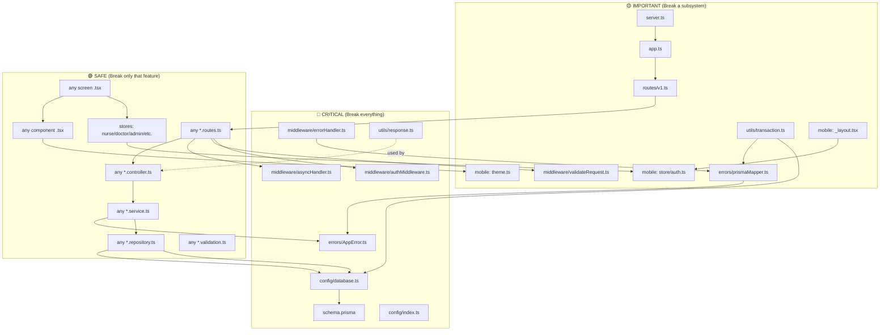

# 🎓 Healix — Lesson 4: Capstone — Feature Maps, Impact Analysis, Workflow & Mental Model

> **Objective**: After this lesson you will have a complete mental map of the entire codebase, know the impact of changing any file, know exactly where to work for any task, and have a structured learning roadmap to master the project.

---

## 4.1 — Complete Feature Maps

For every major feature, here is exactly **where everything lives**:

### 🔐 Authentication

| Layer | Location |
|---|---|
| **UI (Mobile)** | `mobile/src/app/auth/login.tsx`, `register.tsx`, `role-select.tsx`, `verify-otp.tsx`, `forgot.tsx`, `reset.tsx`, `change-password.tsx` |
| **UI (Web)** | `web/src/pages/Login.tsx` |
| **State** | `mobile/src/store/auth.ts` (actions: `register`, `login`, `verifyOtp`, `logout`, `loadUser`, `forgotPassword`, `resetPassword`, `changePassword`) |
| **State (Web)** | `web/src/store/auth.ts` (actions: `login`, `logout`) |
| **API Routes** | `backend/src/features/auth/auth.routes.ts` → POST `/register`, `/login`, `/verify-otp`, `/refresh`, `/logout`, `/forgot-password`, `/reset-password`, GET `/me`, POST `/change-password` |
| **Validation** | `backend/src/features/auth/auth.validation.ts` (Zod: `registerSchema`, `loginSchema`, `otpSchema`, etc.) |
| **Business Logic** | `backend/src/features/auth/auth.service.ts` (bcrypt hashing, JWT signing, OTP generation, session management) |
| **Database Access** | `backend/src/features/auth/auth.repository.ts` (users, otp_codes, sessions, password_reset_tokens) |
| **Database Models** | `User`, `Session`, `OtpCode`, `PasswordResetToken` |
| **Middleware** | `authMiddleware.ts` (`protect`, `restrictTo`) |

---

### 👤 Patient Profile & Medical History

| Layer | Location |
|---|---|
| **UI** | `(patient)/profile/index.tsx`, `(patient)/health/medical.tsx`, `(patient)/health/index.tsx` |
| **Components** | `components/patient/ConditionCard.tsx`, `AllergyCard.tsx`, `MedicationCard.tsx`, `AssignedStaffCard.tsx`, `DashboardHeader.tsx`, `HealthSummaryCard.tsx` |
| **State** | `store/auth.ts` (`fetchPatientProfile`, `updatePatientProfile`, `fetchMedicalHistory`, `addChronicCondition`, `addAllergy`, `addMedication`, `addEmergencyContact`, `deleteEmergencyContact`, `fetchDashboardSummary`, `fetchCarePlans`, `fetchCaregivers`) |
| **API Routes** | `features/patient/patient.routes.ts` → GET/PUT `/:id/profile`, GET `/:id/medical-history`, POST `/:id/conditions`, `/:id/allergies`, `/:id/medications`, POST/DELETE `/:id/emergency-contacts` |
| **Business Logic** | `features/patient/patient.service.ts` (ownership checks, mock geolocation, reschedule time gates) |
| **Database Access** | `features/patient/patient.repository.ts` |
| **Database Models** | `Patient`, `EmergencyContact`, `ChronicCondition`, `Allergy`, `Medication`, `CaregiverLink` |

---

### 📋 Care Requests

| Layer | Location |
|---|---|
| **UI** | `(patient)/requests/index.tsx`, `(patient)/requests/new.tsx` |
| **Components** | `components/patient/RequestCard.tsx`, `RequestFilterPills.tsx`, `RequestTrackingStepper.tsx` |
| **State** | `store/auth.ts` (`createCareRequest`, `cancelCareRequest`, `rescheduleCareRequest`, `fetchCareRequests`) |
| **API Routes** | `features/patient/patient.routes.ts` → POST/GET `/requests`, PUT `/:id/cancel`, `/:id/reschedule` |
| **Business Logic** | `features/patient/patient.service.ts` (cancellation blocks IN_PROGRESS, reschedule blocks <2hrs) |
| **Database Access** | `features/patient/patient.repository.ts` (transactional: creates Request + Visit + Payment + MarketplaceListing atomically) |
| **Database Models** | `CareRequest`, `Visit`, `Payment`, `MarketplaceListing` |

---

### 🩺 Nurse Visits (Full Lifecycle)

| Layer | Location |
|---|---|
| **UI** | `(nurse)/home/index.tsx`, `(nurse)/visits/*` |
| **Components** | `components/nurse/VisitCard.tsx`, `VisitFilterPills.tsx`, `VitalsEntryForm.tsx`, `SymptomChecklist.tsx`, `NurseScoreCard.tsx` |
| **State** | `store/nurse.ts` (`fetchAssignedVisits`, `acceptVisit`, `declineVisit`, `startVisit`, `verifyQr`, `verifyGps`, `verifyManual`, `submitVitals`, `submitSymptoms`, `submitClinicalRemarks`, `completeVisit`, `submitReview`) |
| **API Routes** | `features/visit/visit.routes.ts` → GET `/nurses/:id/visits`, PUT `/visits/:id/accept|decline|start|complete|notes`, POST `/visits/:id/verify-qr|verify-gps|verify-manual|vitals|symptoms|clinical-remarks|rating` |
| **Business Logic** | `features/visit/visit.service.ts` (5-min expiry, QR token validation, GPS Haversine ≤150m, risk auto-escalation, score computation) |
| **Database Access** | `features/visit/visit.repository.ts` (transactional state changes, score upsert, badge awards) |
| **Database Models** | `Visit`, `VitalsRecord`, `VisitSymptom`, `ClinicalRemark`, `VisitVerification`, `RiskAssessment`, `CaseAssignment`, `NurseScore`, `NurseBadge`, `NurseReview`, `AttendanceRecord`, `VisitEvidence` |

---

### 🛒 Marketplace

| Layer | Location |
|---|---|
| **UI** | `(nurse)/marketplace/index.tsx`, patient request screens |
| **State** | `store/marketplace.ts` (`fetchMarketplaceListings`, `submitOffer`, `updateOffer`, `withdrawOffer`, `fetchListingOffers`, `selectOffer`, `addFavoriteNurse`, `fetchCostPreview`) |
| **API Routes** | `features/marketplace/marketplace.routes.ts` |
| **Business Logic** | `features/marketplace/marketplace.service.ts` (PII masking, best match scoring: Price 40% + Rating 40% + Specialty 20%, cost preview + platform fee) |
| **Database Access** | `features/marketplace/marketplace.repository.ts` (atomic offer selection → close listing → assign nurse → create contract) |
| **Database Models** | `MarketplaceListing`, `Offer`, `FavoriteNurse`, `PlatformFeeConfig` |

---

### 📜 Contracts

| Layer | Location |
|---|---|
| **State** | `store/contracts.ts` (`fetchPatientContracts`, `fetchNurseContracts`, `fetchContractDetail`, `approveContract`, `rejectContract`, `cancelContract`) |
| **API Routes** | `features/contract/contract.routes.ts` |
| **Business Logic** | `features/contract/contract.service.ts` (24h auto-expiry, dual-party approval, role validation) |
| **Database Models** | `Contract`, `ContractApproval`, `ContractAuditLog` |

---

### 👨‍⚕️ Doctor Clinical Review

| Layer | Location |
|---|---|
| **UI (Mobile)** | `(doctor)/home/index.tsx`, `(doctor)/reviews/*`, `(doctor)/diagnosis/*` |
| **UI (Web)** | `web/src/pages/doctor/Dashboard.tsx`, `CaseReview.tsx`, `HomeVisits.tsx` |
| **State (Mobile)** | `store/doctor.ts` |
| **State (Web)** | `web/src/store/doctor.ts` |
| **API Routes** | `features/doctor/doctor.routes.ts` → GET `/doctors/queue`, `/queue/high-risk`, PUT `/cases/:id/accept`, GET `/cases/:id/review`, POST `/cases/:id/diagnosis|care-plan|prescriptions|decision|second-opinion|ai-feedback` |
| **Business Logic** | `features/doctor/doctor.service.ts` (SLA countdown, allergy cross-check on prescriptions, CDSS mock advisory, diagnosis versioning, emergency auto-dispatch) |
| **Database Models** | `CaseAssignment`, `Diagnosis`, `Prescription`, `PrescriptionItem`, `CarePlan`, `CarePlanMilestone`, `ClinicalDecision`, `SecondOpinion`, `DoctorHomeVisit`, `AiFeedback` |

---

### 🚨 Emergency Pipeline

| Layer | Location |
|---|---|
| **State** | Triggered automatically by `visit.service.ts` (clinical remarks) and `chat.service.ts` (AI SOS keywords) |
| **API Routes** | `features/emergency/escalation/escalation.routes.ts`, `dispatch/dispatch.routes.ts`, `admission/admission.routes.ts` |
| **Business Logic** | Escalation (assign doctor, create chat thread, broadcast to all doctors) → Dispatch (hospital recommendation via Haversine, ambulance ETA tracking) → Admission (status tracking, auto-follow-up on discharge) |
| **Database Models** | `EmergencyEvent`, `CaseAssignment`, `NurseDoctorThread`, `Hospital`, `AmbulanceDispatch`, `Admission` |

---

### 🛡️ Admin Platform Management

| Layer | Location |
|---|---|
| **UI (Mobile)** | `admin/index.tsx`, `admin/users.tsx`, `admin/nurses.tsx`, `admin/doctors.tsx`, `admin/config.tsx` |
| **UI (Web)** | `web/src/pages/admin/Dashboard.tsx`, `Users.tsx`, `NurseVerification.tsx`, `DoctorVerification.tsx`, `Marketplace.tsx`, `Config.tsx`, `AuditLogs.tsx` |
| **State (Mobile)** | `store/admin.ts` |
| **State (Web)** | `web/src/store/admin.ts` |
| **API Routes** | `features/admin/admin.routes.ts` (all behind `requireAdmin`) |
| **Business Logic** | `features/admin/admin.service.ts` (self-protection: can't moderate admins, session invalidation on suspend, doctor revocation re-escalates active cases, config masking, CSV audit export) |
| **Database Models** | `Administrator`, `AdminAuditLog`, `PlatformConfig`, `UserDocument` |

---

## 4.2 — Full Dependency Graph



---

## 4.3 — Modification Impact Analysis

### 🔴 CRITICAL FILES — Changes Affect EVERYTHING

| File | If You Change It | What Breaks | Must Test |
|---|---|---|---|
| `schema.prisma` | Database structure changes | All repositories, all Prisma queries, requires migration | Run `prisma migrate dev`, test all CRUD endpoints |
| `config/database.ts` | DB connection changes | All database access | Every API endpoint |
| `config/index.ts` | Env validation changes | Server may refuse to start | Server boot |
| `errors/AppError.ts` | Error constructor changes | Every `throw new AppError()` | All error responses |
| `middleware/authMiddleware.ts` | Auth logic changes | ALL authenticated routes, ALL users locked out | Login, every protected endpoint, every role |
| `middleware/errorHandler.ts` | Error formatting changes | ALL error response shapes | Frontend error parsing |
| `middleware/asyncHandler.ts` | Async wrapper changes | ALL async routes crash silently | Every endpoint |
| `utils/response.ts` | Response format changes | ALL API responses, frontend parsing | Every store's response handling |
| `mobile: theme.ts` | Color/spacing changes | Every screen's visual appearance | Visual review of all screens |
| `mobile: _layout.tsx` | Auth guard changes | Redirect loops, locked out users, RBAC bypass | All 4 roles login + navigation |
| `mobile: store/auth.ts` | Auth/patient state changes | Patient features, token management, all other stores | Login, patient dashboard, token refresh |

### 🟡 IMPORTANT FILES — Changes Affect a Subsystem

| File | If You Change It | What Breaks | Must Test |
|---|---|---|---|
| `routes/v1.ts` | Route registration | Missing endpoints, wrong prefixes | API route availability |
| `app.ts` | Middleware order | Request parsing, CORS, security headers | Cross-origin, body parsing, error handling |
| `server.ts` | Lifecycle | Graceful shutdown, admin seeding | Server start/stop, first-boot admin |
| `middleware/validateRequest.ts` | Validation logic | All Zod validation | Endpoints with validation |
| `mobile: (role)/_layout.tsx` | Tab structure | Navigation for that role | All screens in that role |
| `web: App.tsx` | Web routing | Admin/doctor web access | Web login, all web pages |

### 🟢 SAFE FILES — Changes Are Isolated

| File | If You Change It | What Breaks | Must Test |
|---|---|---|---|
| Any `*.routes.ts` | Only that feature's endpoints | Only screens calling those endpoints |
| Any `*.controller.ts` | Only that feature's request handling | Only that feature |
| Any `*.service.ts` | Only that feature's business logic | Only that feature |
| Any `*.repository.ts` | Only that feature's DB queries | Only that feature |
| Any `*.validation.ts` | Only that feature's input validation | Only that feature's forms |
| Any screen `.tsx` | Only that screen | Only that screen |
| Any component `.tsx` | Only screens using that component | Screens importing it |
| Any role-specific store | Only that role's data | Only that role's screens |

---

## 4.4 — Development Workflow (How To Do Common Tasks)

### Task 1: Add a New Screen

```
1. Create file: mobile/src/app/(role)/newscreen/index.tsx
2. Import the appropriate store: useXxxStore
3. Call store actions in useEffect for data fetching
4. Build UI using theme.ts tokens and existing components
5. If the screen needs a tab entry:
   → Edit mobile/src/app/(role)/_layout.tsx
   → Add <Tabs.Screen name="newscreen" ... />
6. If the screen is hidden from tabs:
   → Add tabBarButton: () => null in Tabs.Screen options
```

### Task 2: Add a New API Endpoint

```
1. Add Zod schema: backend/src/features/{feature}/{feature}.validation.ts
2. Add repository method: {feature}.repository.ts (Prisma query)
3. Add service method: {feature}.service.ts (business logic calling repo)
4. Add controller: {feature}.controller.ts (extract req, call service, send response)
5. Add route: {feature}.routes.ts (map URL → middleware → controller)
6. If new feature entirely → register in routes/v1.ts
```

### Task 3: Add a New Database Table

```
1. Add model to backend/prisma/schema.prisma
2. Add relations to existing models if needed
3. Run: cd backend && pnpm prisma:migrate
4. Create repository methods for the new model
5. Create service layer for business logic
6. Create routes + controllers
7. Register routes in v1.ts
```

### Task 4: Add a New Zustand Store

```
1. Create: mobile/src/store/newfeature.ts
2. Follow the pattern:
   export const useNewFeatureStore = create<State>((set, get) => ({
     data: null,
     isLoading: false,
     error: null,
     fetchData: async (token: string) => {
       set({ isLoading: true, error: null });
       try {
         const res = await fetch(`${API_URL}/endpoint`, {
           headers: { Authorization: `Bearer ${token}` }
         });
         const data = await res.json();
         if (!data.success) throw new Error(data.message);
         set({ data: data.data, isLoading: false });
       } catch (err: any) {
         set({ error: err.message, isLoading: false });
       }
     }
   }));
3. Import in screens: const { data, fetchData } = useNewFeatureStore();
```

### Task 5: Add a New User Role

```
⚠️ HIGH IMPACT — touches many files:
1. schema.prisma: Add to Role enum, create role model
2. Run migration
3. auth.repository.ts: Handle new role in createUser()
4. auth.service.ts: Handle new role in verifyOtp() activation logic
5. authMiddleware.ts: Add to restrictTo() where needed
6. mobile/src/app/_layout.tsx: Add redirect route for new role
7. mobile/src/app/index.tsx: Add role case to redirect
8. Create mobile/src/app/(newrole)/_layout.tsx with tabs
9. Create screens inside (newrole)/
10. Create store for the role
11. Optionally: add web dashboard pages
```

### Task 6: Add a New Component

```
1. Determine scope:
   - Shared across roles → components/common/
   - Patient-specific → components/patient/
   - Nurse-specific → components/nurse/
   - Generic UI → components/ui/
2. Make it presentational (props in, UI out, no store access)
3. Use theme.ts for all colors, spacing, typography
4. Export as a named export
```

### Task 7: Add Notifications for a Feature

```
1. Import NotificationService in your feature's service
2. Call: NotificationService.dispatchNotification({
     userId, category, title, body, channel
   })
3. Categories: APPOINTMENT, RISK, PAYMENT, EMERGENCY
4. Channels: PUSH, SMS, IN_APP
5. EMERGENCY category bypasses quiet hours automatically
```

### Task 8: Modify Navigation

```
Mobile:
1. Edit the role's _layout.tsx to add/remove/reorder tabs
2. Hidden screens: set tabBarButton: () => null
3. Deep links: use router.push('/(role)/screen')

Web:
1. Edit web/src/App.tsx for new routes
2. Edit web/src/components/Sidebar.tsx for nav items
3. Add page in web/src/pages/
```

### Task 9: Change Authentication Logic

```
⚠️ HIGH IMPACT:
Backend:
1. auth.service.ts for login/register/JWT logic
2. authMiddleware.ts for token verification
3. config/index.ts if adding new JWT-related env vars
Frontend:
1. store/auth.ts for token storage/refresh
2. _layout.tsx for redirect logic
Must test: ALL roles login, token refresh, protected routes
```

### Task 10: Add File Upload

```
Backend already has multer installed:
1. Add multer middleware to your route
2. Access file via req.file
3. Store URL in database
4. Example: nurse document upload in nurse.routes.ts
```

### Task 11: Add a Web Admin Page

```
1. Create: web/src/pages/admin/NewPage.tsx
2. Import in web/src/App.tsx
3. Add to AdminLayout: {activeTab === 'newpage' && <NewPage />}
4. Add nav item in web/src/components/Sidebar.tsx
5. Add store actions if needed in web/src/store/admin.ts
```

### Task 12: Debug a Problem

```
1. Identify which feature the bug is in
2. Check the screen file → which store action is called?
3. Check the store action → which API endpoint is called?
4. Check the backend route → which controller?
5. Check the controller → which service method?
6. Check the service → which repository method?
7. Check the repository → which Prisma query?
8. Check Winston logs for error details
9. Use Prisma Studio (pnpm prisma:studio) to inspect DB directly
```

---

## 4.5 — Project Conventions (As Currently Implemented)

### Coding Conventions

| Convention | Rule |
|---|---|
| **Language** | TypeScript everywhere (backend + mobile + web) |
| **Naming: Files** | kebab-case for components (`themed-text.tsx`), dot-notation for features (`auth.service.ts`) |
| **Naming: Components** | PascalCase (`DashboardHeader`, `VisitCard`) |
| **Naming: Functions** | camelCase (`fetchNurseProfile`, `submitVitals`) |
| **Naming: Constants** | UPPER_SNAKE_CASE (`HTTP_STATUS`, `COLORS`) |
| **Exports** | Named exports for components and utilities, default exports for routers and screens |

### Architecture Conventions

| Convention | Rule |
|---|---|
| **Backend layers** | Route → Validation → Controller → Service → Repository (never skip layers) |
| **Controllers** | Thin — extract data, call service, return response. NO business logic. |
| **Services** | Thick — all business rules, validation, orchestration live here |
| **Repositories** | Pure database access — no business logic, just Prisma queries |
| **Stores** | Own all API calls and state. Screens should NOT call fetch() directly. |
| **Components** | Presentational only. Receive data via props, never access stores. |
| **Screens** | Smart — connect to stores, pass data down to components |

### API Conventions

| Convention | Rule |
|---|---|
| **Base path** | `/api/v1/` |
| **Auth header** | `Authorization: Bearer <token>` |
| **Success response** | `{ success: true, message: "...", data: {...} }` |
| **Error response** | `{ success: false, message: "...", errors: [...] }` |
| **Validation** | Zod schemas in `*.validation.ts`, applied via `validateRequest()` middleware |
| **Status codes** | 200 (OK), 201 (Created), 400 (Bad Request), 401 (Unauthorized), 403 (Forbidden), 404 (Not Found), 409 (Conflict), 500 (Server Error) |

### State Management Conventions

| Convention | Rule |
|---|---|
| **State library** | Zustand (both mobile and web) |
| **Store pattern** | `create<State>((set, get) => ({ ...state, ...actions }))` |
| **Loading state** | Every store has `isLoading: boolean` |
| **Error state** | Every store has `error: string \| null` with `clearError()` |
| **Token passing** | Auth store owns the token; other stores receive it as function argument |

---

## 4.6 — Mental Model

### How to Think About This Codebase

```
┌─────────────────────────────────────────────────┐
│                  THE MENTAL MAP                  │
├─────────────────────────────────────────────────┤
│                                                 │
│  DATA OWNERS        = Prisma schema + Repos     │
│  BUSINESS LOGIC     = Services                  │
│  API SURFACE        = Routes + Controllers      │
│  APP STATE          = Zustand Stores             │
│  USER INTERFACE     = Screens + Components       │
│  VISUAL LANGUAGE    = theme.ts                   │
│  ACCESS CONTROL     = _layout.tsx + authMW       │
│                                                 │
└─────────────────────────────────────────────────┘
```

### Which Files Own What

| Ownership | Files |
|---|---|
| **Data ownership** | `schema.prisma` defines what data can exist. Repositories are the only files allowed to touch the database. |
| **Business logic ownership** | `*.service.ts` files. All rules, validations, computations, and orchestration live here. |
| **UI ownership** | Screens own layout and data binding. Components own visual presentation. |
| **State ownership** | Zustand stores own ALL reactive state and ALL API communication. |
| **Access control** | `_layout.tsx` (frontend RBAC), `authMiddleware.ts` (backend RBAC) |

### Which Files Should Remain Thin

| File Type | Why It Should Be Thin |
|---|---|
| **Controllers** | Only extract request data and call services. No `if/else` business logic. |
| **Routes** | Only map URLs to middleware chains and controllers. |
| **Components** | Only render UI from props. No API calls, no store access. |
| **Screens** | Bind stores to components. Minimal inline logic. |

### Which Files Should NEVER Contain Business Logic

| File | Why |
|---|---|
| Controllers | They're HTTP adapters, not decision makers |
| Repositories | They're data access, not rule enforcers |
| Components | They're visual, not logical |
| Routes | They're URL maps, not processors |
| Middleware | They're pipeline steps, not feature logic (except auth, which is special) |

### Which Files Should Almost NEVER Change

| File | Why | Last Resort Only |
|---|---|---|
| `middleware/asyncHandler.ts` | 5 lines, foundational | Bug fix only |
| `errors/AppError.ts` | Constructor used everywhere | Never change signature |
| `config/database.ts` | Prisma singleton | Connection tuning only |
| `utils/response.ts` | Response format contract | Would break all frontends |
| `middleware/authMiddleware.ts` | Auth contract | Security patches only |

### Which Files Are Most Edited During Feature Development

| File Type | How Often | Why |
|---|---|---|
| `*.service.ts` | Very frequent | New business rules |
| `*.repository.ts` | Frequent | New queries |
| `*.routes.ts` | Frequent | New endpoints |
| `*.controller.ts` | Frequent | New request handlers |
| `*.validation.ts` | Frequent | New schemas |
| Screen `.tsx` files | Very frequent | New UI |
| Store `.ts` files | Frequent | New state and API calls |
| Component `.tsx` files | Frequent | New UI pieces |
| `schema.prisma` | Occasional | New tables/fields |
| `routes/v1.ts` | Occasional | Registering new feature routers |

---

## 4.7 — Personalized Learning Roadmap

Study these in order. Each builds on the previous. Don't skip ahead.

### Phase 1: Foundation (Understand the Skeleton)

| Step | What to Study | Files | What You'll Learn |
|---|---|---|---|
| **1** | Root config | `package.json` (root), `pnpm-workspace.yaml` | How the monorepo is organized |
| **2** | Backend entry | `server.ts`, `app.ts` | How the server boots and what middleware runs |
| **3** | Environment | `config/index.ts`, `.env` | How env vars are validated and accessed |
| **4** | Database setup | `config/database.ts`, `schema.prisma` (first 100 lines) | How Prisma connects and what User/Patient/Nurse/Doctor look like |
| **5** | Response format | `utils/response.ts`, `constants/index.ts` | The API response contract |

### Phase 2: Infrastructure (Understand the Plumbing)

| Step | What to Study | Files | What You'll Learn |
|---|---|---|---|
| **6** | Error system | `errors/AppError.ts`, `errors/prismaMapper.ts`, `middleware/errorHandler.ts` | How errors flow from throw → response |
| **7** | Auth middleware | `middleware/authMiddleware.ts`, `middleware/asyncHandler.ts` | How JWT verification and RBAC work |
| **8** | Validation | `middleware/validateRequest.ts`, any `*.validation.ts` | How request data is validated |
| **9** | Utilities | `utils/logger.ts`, `utils/pagination.ts`, `utils/queryHelper.ts`, `utils/transaction.ts` | Helper patterns used across features |

### Phase 3: First Feature (Understand the Pattern)

| Step | What to Study | Files | What You'll Learn |
|---|---|---|---|
| **10** | Auth feature (complete) | `auth/auth.routes.ts` → `auth.validation.ts` → `auth.controller.ts` → `auth.service.ts` → `auth.repository.ts` | The 5-layer pattern end-to-end |
| **11** | Route aggregation | `routes/v1.ts` | How features connect to the API |

### Phase 4: Frontend Core (Understand the Shell)

| Step | What to Study | Files | What You'll Learn |
|---|---|---|---|
| **12** | Theme system | `mobile/src/theme.ts` | The visual design language |
| **13** | Root navigation | `mobile/src/app/_layout.tsx`, `index.tsx` | Auth guard and role routing |
| **14** | Auth store | `mobile/src/store/auth.ts` | How state management and API calls work together |
| **15** | Patient layout + home | `(patient)/_layout.tsx`, `(patient)/home/index.tsx` | How tabs and screens work |

### Phase 5: Full Feature Flows (Connect Frontend to Backend)

| Step | What to Study | Files | What You'll Learn |
|---|---|---|---|
| **16** | Patient feature | `patient.routes.ts` → `patient.service.ts` + `store/auth.ts` + patient screens | Full patient data flow |
| **17** | Nurse feature | `nurse.routes.ts` → `nurse.service.ts` + `store/nurse.ts` + nurse screens | Nurse lifecycle |
| **18** | Visit feature | `visit.routes.ts` → `visit.service.ts` + nurse visit screens | The clinical visit workflow |

### Phase 6: Advanced Systems (Master the Complex Parts)

| Step | What to Study | Files | What You'll Learn |
|---|---|---|---|
| **19** | Marketplace + Contracts | `marketplace/` + `contract/` + stores | Bidding economy and legal contracts |
| **20** | Doctor + Clinical + Emergency | `doctor/` + `clinical/` + `emergency/` + stores | AI risk assessment, escalation pipeline, ambulance dispatch |

### Phase 7: Admin & Operations (Complete Mastery)

| Step | What to Study | Files | What You'll Learn |
|---|---|---|---|
| **Bonus** | Admin module + Web dashboard | `admin/` + `web/src/` | Platform governance, audit trails, config management |

---

## 4.8 — Quick Reference Card

```
┌──────────────────────────────────────────────────────┐
│              HEALIX QUICK REFERENCE                  │
├──────────────────────────────────────────────────────┤
│                                                      │
│  START SERVER:    pnpm backend:dev                    │
│  START MOBILE:    pnpm mobile:start                   │
│  DB MIGRATE:      cd backend && pnpm prisma:migrate   │
│  DB INSPECT:      cd backend && pnpm prisma:studio    │
│  DB SEED:         cd backend && npx tsx src/seed.ts   │
│                                                      │
│  API BASE:        http://localhost:3000/api/v1        │
│  HEALTH CHECK:    http://localhost:3000/health        │
│  WEB DASHBOARD:   http://localhost:3000/              │
│                                                      │
│  DEFAULT ADMIN:   admin@healix.pk / Admin@1234        │
│  TEST ACCOUNTS:   See seed.ts (password: abc123$%)    │
│                                                      │
│  ADD ENDPOINT:    route → validate → ctrl → svc → repo│
│  ADD SCREEN:      app/(role)/name.tsx → store → API   │
│  ADD COMPONENT:   components/(role)/Name.tsx → props  │
│  ADD STORE:       store/name.ts → create((set,get))   │
│  ADD TABLE:       schema.prisma → prisma migrate dev  │
│                                                      │
│  DEBUG PATH:      Screen → Store → API → Route →      │
│                   Controller → Service → Repository → │
│                   Prisma → PostgreSQL                  │
│                                                      │
└──────────────────────────────────────────────────────┘
```

---

## ✅ All 4 Lessons Complete

You have now received a complete guided tour of the Healix codebase covering:

| Lesson | Topic | Key Takeaways |
|---|---|---|
| **Lesson 1** | Architecture | 3-app monorepo, tech stack, communication, auth flow, 40+ DB models |
| **Lesson 2** | Backend | Boot sequence, middleware pipeline, 17 infrastructure files, 14 feature modules, all business rules |
| **Lesson 3** | Frontend | Expo Router navigation, auth guard, 8 Zustand stores, 44+ components, 3 data flow traces, web dashboard |
| **Lesson 4** | Mastery | Feature maps, dependency graphs, impact analysis, development workflow, conventions, mental model, learning roadmap |

> You are now equipped to navigate the entire codebase, implement new features, debug issues, and review pull requests with confidence. Follow the learning roadmap in order, and use the quick reference card as your daily guide.
